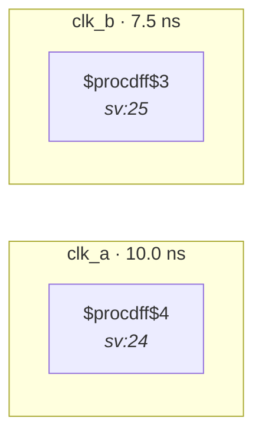

# Fixture: `bad_unconstrained_input_two_domains`

<!-- generator: scripts/gen_fixture_docs.py -->

Regression-baseline fixture for issue #97 (CDC-011, pending).

Scalar input `in` has no `set_input_delay -clock` typing in the SDC and is captured by flops in two distinct clock domains (`clk_a`, `clk_b`) declared asynchronous. With CDC-011 absent today, find_crossings never walks the untyped port and the rule pack reports clean — locking that current behaviour in so any later change (CDC-011 landing, or a data-model change that retroactively walks untyped ports) is forced to update the paired test.

When CDC-011 lands, flip the test assertion to expect one error-severity violation: `in` captured in {clk_a, clk_b}, which is intrinsically wrong regardless of SDC opinion (a single port cannot be synchronous to two distinct clocks).

- **Status:** negative — analyzer must report a violation
- **Top module:** `bad_unconstrained_input_two_domains`
- **Clocks:** `clk_a` (10.0 ns), `clk_b` (7.5 ns)
- **Crossings:** 2 structural (2 async-per-SDC, 0 sync)

## Clock-domain map

## Files

- `bad_unconstrained_input_two_domains.json`
- `bad_unconstrained_input_two_domains.sdc`
- `bad_unconstrained_input_two_domains.sv`

---
*Generated by `scripts/gen_fixture_docs.py` — re-run after editing the SV/SDC/netlist.*
