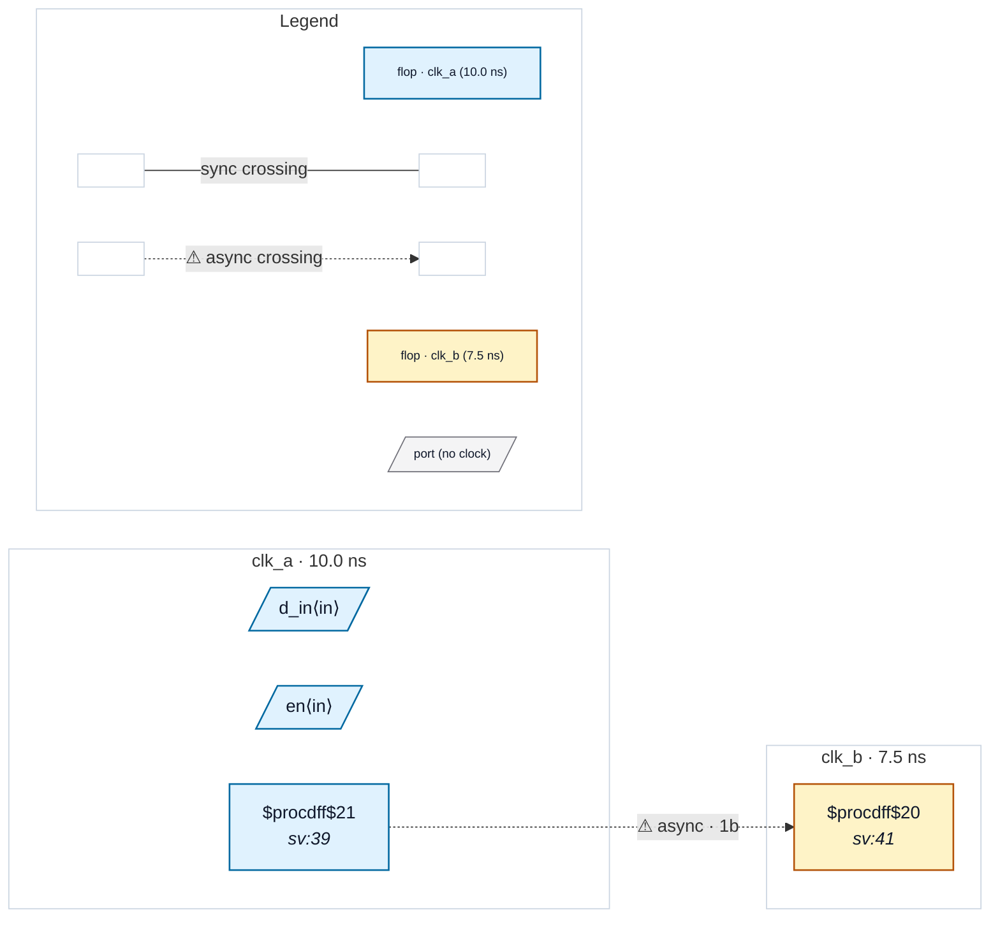

# Fixture: `bad_unresolved_clock_latch`

<!-- generator: scripts/gen_fixture_docs.py -->

Coverage fixture for issue #263 — a flop clocked through a transparent latch resolves to domain-unknown, so it is silently EXCLUDED from CDC analysis.

`unresolved_q` is clocked by `gclk`, which is driven by a $dlatch whose D is `clk_a`. The clock-root tracer (domain.py `_trace`) follows buffers, clock gates, muxes and flop-Q dividers, but NOT a $dlatch Q — so `gclk` (and the flop it clocks) trace to None / `<unresolved>`.

This is the P0 visibility repro: nothing today tells the user that a flop was dropped from analysis. P2 will teach the tracer to follow a clock-path latch and this flop will then resolve to `clk_a` (the fixture expectation moves there, not here).

The design also carries a real clk_a -> clk_b crossing (`a_q` -> `b_q`) so the fixture doubles as a parity anchor: adding the visibility diagnostic must not perturb the crossing/violation that the analyzer already sees.

- **Status:** negative — analyzer must report a violation
- **Top module:** `bad_unresolved_clock_latch`
- **Clocks:** `clk_a` (10.0 ns), `clk_b` (7.5 ns)
- **Crossings:** 1 structural (1 async-per-SDC, 0 sync)

## Clock-domain map

## Files

- `bad_unresolved_clock_latch.json`
- `bad_unresolved_clock_latch.sdc`
- `bad_unresolved_clock_latch.sv`

---
*Generated by `scripts/gen_fixture_docs.py` — re-run after editing the SV/SDC/netlist.*
