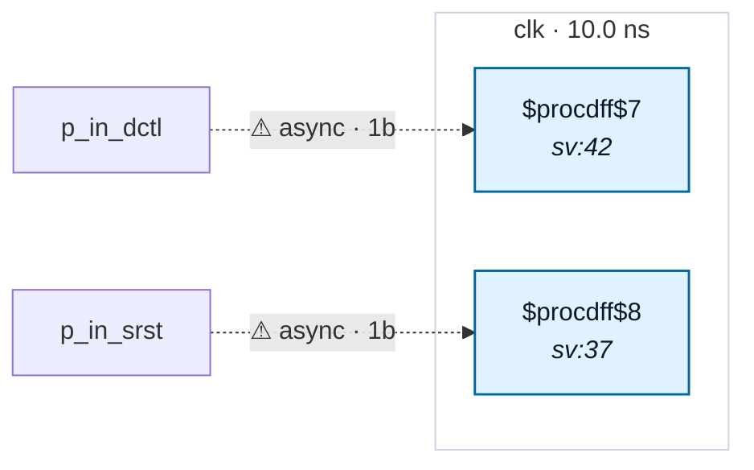

# Fixture: `bad_untyped_sync_reset_mux`

<!-- generator: scripts/gen_fixture_docs.py -->

Parity anchor for rtl-buddy-cdc#272 — the same untyped sync reset, lowered the *other* way.

Byte-for-byte the RTL and SDC of `bad_untyped_sync_reset_srst`, but built without `opt_dff`, so Yosys keeps a plain `$dff` whose `D` is a `$mux` selecting between `1'b0` and `~qr` on `srst`. The reset therefore arrives on a `D` pin and the ordinary port walk in `find_crossings` sees it.

This shape was always reported. It is checked in so the pair pins the invariant the issue asked for: a missing `set_input_delay -clock` on a synchronous reset must produce the *same* CDC-011 finding — same rule id, same severity, same message — whichever flop cell the synthesis pass infers.

CDC-011 must fire twice at `warning` severity (`srst`, `dctl`) and no other rule may fire.

```text
Build:
  yosys -p 'read_verilog -sv bad_untyped_sync_reset_mux.sv;
            hierarchy -top bad_untyped_sync_reset_mux;
            proc; flatten; opt_clean;
            write_json bad_untyped_sync_reset_mux.json'
```

No `opt_dff` — that is the whole point of this fixture.

- **Status:** negative — analyzer must report a violation
- **Top module:** `bad_untyped_sync_reset_mux`
- **Clocks:** `clk` (10.0 ns)
- **Crossings:** 2 structural (2 async-per-SDC, 0 sync)

## Clock-domain map



## Files

- `bad_untyped_sync_reset_mux.json`
- `bad_untyped_sync_reset_mux.sdc`
- `bad_untyped_sync_reset_mux.sv`

---
*Generated by `scripts/gen_fixture_docs.py` — re-run after editing the SV/SDC/netlist.*
