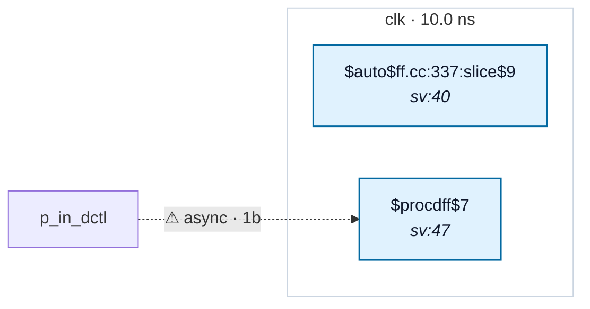

# Fixture: `bad_untyped_sync_reset_srst`

<!-- generator: scripts/gen_fixture_docs.py -->

Negative-case fixture for CDC-011 — an untyped primary-input **synchronous reset** that lowers to a dedicated `$sdff` `SRST` pin.

`srst` and `dctl` are both top-level inputs the SDC leaves untyped (no `set_input_delay -clock`). `dctl` lands on a flop's `D` pin; `srst` lands on a flop's `SRST` pin because `qr` has no external data input to fold a reset mux into — it just self-toggles.

The crossing model is `D`-pin-scoped, so the `SRST` arrival produces no `Crossing` record at all. Before rtl-buddy-cdc#272, CDC-011 saw only `dctl` and the missing SDC typing on `srst` went unreported — the finding depended on which flop cell the synthesis pass happened to infer. CDC-011 now walks `SRST` pins directly, so both ports are flagged identically here and in the paired `bad_untyped_sync_reset_mux` fixture (same RTL, `$dff` + reset-mux lowering).

CDC-011 must fire twice at `warning` severity — once on `srst`, once on `dctl` — and no other rule may fire.

```text
Build:
  yosys -p 'read_verilog -sv bad_untyped_sync_reset_srst.sv;
            hierarchy -top bad_untyped_sync_reset_srst;
            proc; opt_dff; flatten; opt_clean;
            write_json bad_untyped_sync_reset_srst.json'
```

`opt_dff` is what folds the reset mux into `$sdff`. Dropping it yields the `$dff` shape the parity fixture pins instead.

- **Status:** negative — analyzer must report a violation
- **Top module:** `bad_untyped_sync_reset_srst`
- **Clocks:** `clk` (10.0 ns)
- **Crossings:** 1 structural (1 async-per-SDC, 0 sync)

## Clock-domain map



## Files

- `bad_untyped_sync_reset_srst.json`
- `bad_untyped_sync_reset_srst.sdc`
- `bad_untyped_sync_reset_srst.sv`

---
*Generated by `scripts/gen_fixture_docs.py` — re-run after editing the SV/SDC/netlist.*
