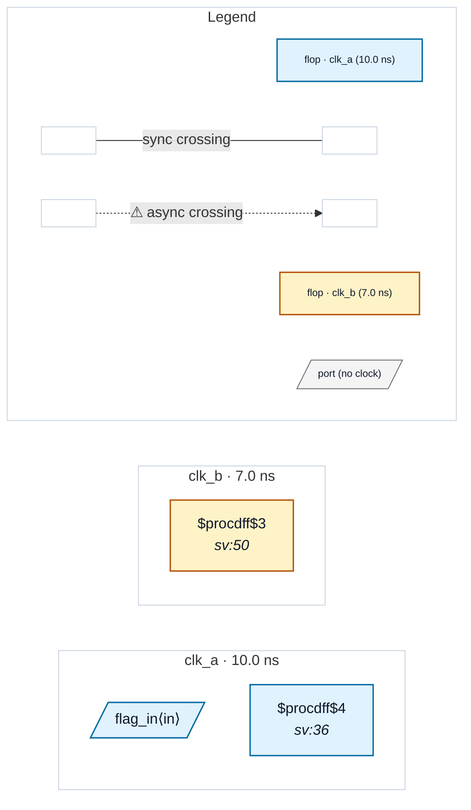

# Fixture: `bad_xpm_shallow_sync_depth`

<!-- generator: scripts/gen_fixture_docs.py -->

Negative-case fixture for CDC-022 (rtl-buddy-cdc#275).

`xpm_cdc_single` carries its synchroniser stage count as the `DEST_SYNC_FF` parameter, not as a flop chain — the stages live inside the macro, which the analyzer sees only as a blackbox. Once the macro is recognised as a synchroniser its crossing stops being reported, so CDC-002 (which walks a real chain) can never speak to the depth question again.

Here the instance declares DEST_SYNC_FF=2. Under a project requiring `--sync-depth 3` that is short, and CDC-022 is the only rule that can say so. At the default `--sync-depth 2` the same design is silent, exactly mirroring CDC-002's default-silent posture.

- **Status:** negative — analyzer must report a violation
- **Top module:** `bad_xpm_shallow_sync_depth`
- **Clocks:** `clk_a` (10.0 ns), `clk_b` (7.0 ns)
- **Crossings:** 0 structural (0 async-per-SDC, 0 sync)

## Clock-domain map

## Files

- `bad_xpm_shallow_sync_depth.json`
- `bad_xpm_shallow_sync_depth.sdc`
- `bad_xpm_shallow_sync_depth.sv`

---
*Generated by `scripts/gen_fixture_docs.py` — re-run after editing the SV/SDC/netlist.*
