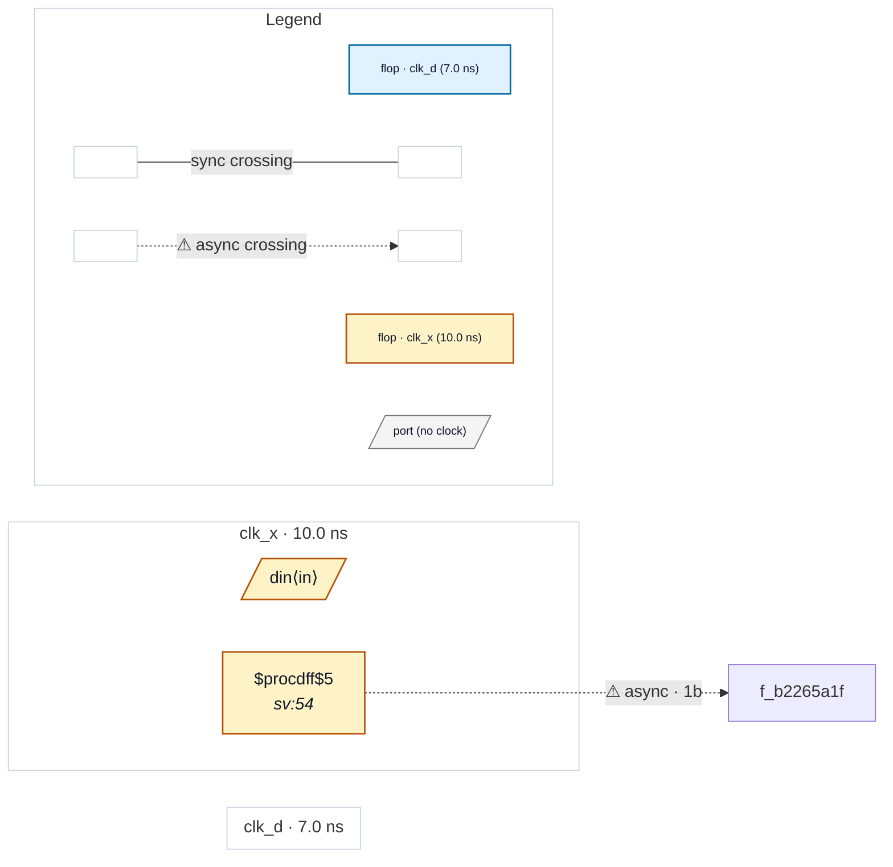

# Fixture: `bbx_input_sync`

<!-- generator: scripts/gen_fixture_docs.py -->

Compositional-boundary input-synchroniser fixture (rtl-buddy-cdc#261).

`ctrl_sync` is a SINGLE-CLOCK (clk_d) block whose only foreign-domain input, `req_in`, lands on a textbook synchroniser: two clk_d stages (`s0` -> `s1`) before the value is used. Nothing else reads `req_in`, so the chain is the ONLY consumer — which is exactly what makes the claim "this IP synchronises its input" provable rather than assumed.

What #261 changes. Abstraction summarises the block to its port boundary, and the virtual sink standing in for `req_in` has no `Q`, so the structural sync-chain walk can only ever answer depth 1 — CDC-001 fired on every abstracted single-bit input no matter how good the IP was (architecture spec section 4.9, "the `synchronised` field is presently inert"). The compositional pass analyses `ctrl_sync` on its own internals, PROVES the depth-3 chain, and publishes it, so the boundary rules behave exactly as they do on the flattened design.

The parent deliberately consumes `ack_out` on an UNREGISTERED output port. A parent-side capture flop would extend the synchroniser chain across the boundary, and a chain that spans the boundary is measured differently on each side by construction — see the note on chain truncation in architecture spec section 4.9.

FLAT: the clk_x -> clk_d crossing is reported, CDC-001 is silent (depth 3), and `--sync-depth 4` raises CDC-002. GREYBOXED (`.grey.json`): identical — same crossing, same rule set. STUB-BLACKBOXED (`.json`, no internals): the crossing is reported and CDC-001 FIRES — the documented over-report this fixture retires.

- **Status:** auxiliary
- **Top module:** `bbx_input_sync`
- **Clocks:** `clk_d` (7.0 ns), `clk_x` (10.0 ns)
- **Crossings:** 1 structural (1 async-per-SDC, 0 sync)

## Clock-domain map

## Files

- `bbx_input_sync.flat.json`
- `bbx_input_sync.grey.json`
- `bbx_input_sync.json`
- `bbx_input_sync.sdc`
- `bbx_input_sync.sv`

---
*Generated by `scripts/gen_fixture_docs.py` — re-run after editing the SV/SDC/netlist.*
