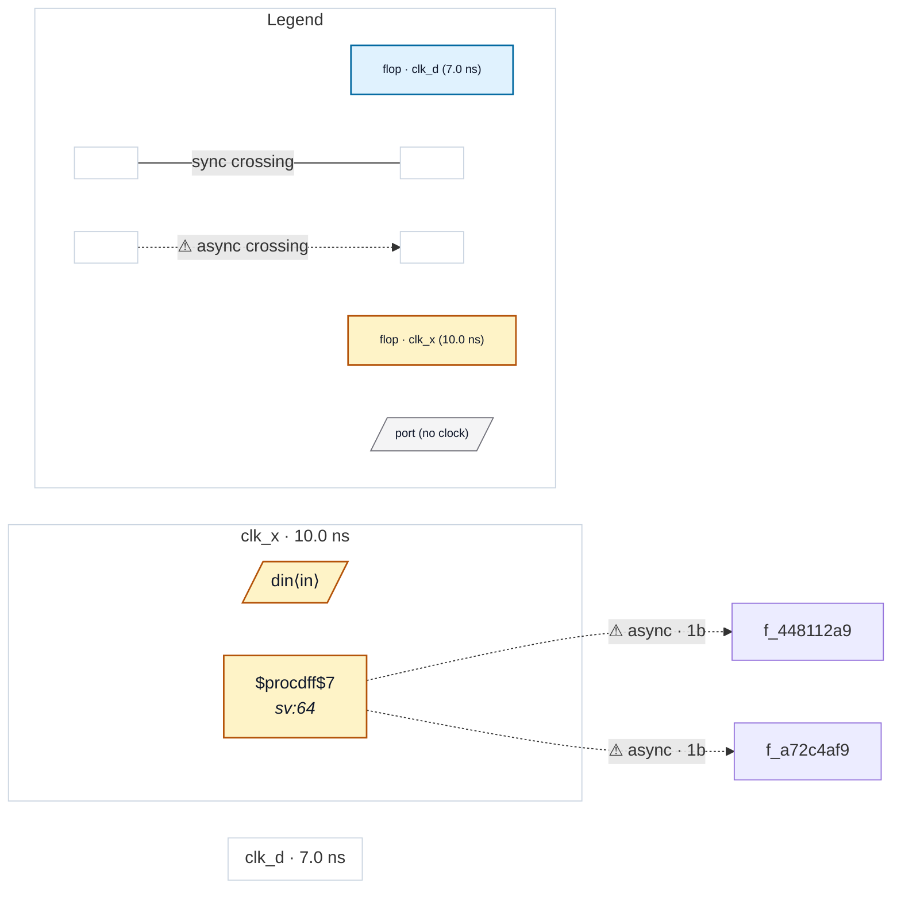

# Fixture: `bbx_input_sync_broken`

<!-- generator: scripts/gen_fixture_docs.py -->

Compositional-boundary NEGATIVE control (rtl-buddy-cdc#261).

The paired counter-example to `bbx_input_sync`: two single-clock (clk_d) blocks that LOOK like they synchronise their boundary input but do not, one per way the proof must fail. Neither may be granted `synchronised` — `synchronised=True` is the only lever in the boundary model that can make the analyzer UNDER-report, so it is set only from a proof (architecture spec section 4.9, "soundness asymmetry").

```text
  * `oneff` — a SINGLE flop on `req_in`. Chain depth 1: a synchroniser
    is two stages, so this is the classic metastability bug CDC-001
    exists for.
  * `bypass` — a proper two-stage chain (`s0` -> `s1`) that is
    BYPASSED: `req_in` is also captured raw by `raw_q`, and the two are
    recombined. The chain is real; the value still arrives
    unsynchronised. Structurally, `req_in` has TWO readers, which is
    what defeats the proof.
```

As in `bbx_input_sync`, the parent consumes both outputs on UNREGISTERED ports so no parent-side flop extends a chain across the boundary.

FLAT: CDC-001 fires twice — once on `oneff`'s lone flop, once on `bypass`'s raw capture. GREYBOXED: CDC-001 fires twice, at the two boundary input pins. Same rule, same severity, same count; the boundary is not trusted.

- **Status:** auxiliary
- **Top module:** `bbx_input_sync_broken`
- **Clocks:** `clk_d` (7.0 ns), `clk_x` (10.0 ns)
- **Crossings:** 2 structural (2 async-per-SDC, 0 sync)

## Clock-domain map



## Files

- `bbx_input_sync_broken.flat.json`
- `bbx_input_sync_broken.grey.json`
- `bbx_input_sync_broken.json`
- `bbx_input_sync_broken.sdc`
- `bbx_input_sync_broken.sv`

---
*Generated by `scripts/gen_fixture_docs.py` — re-run after editing the SV/SDC/netlist.*
