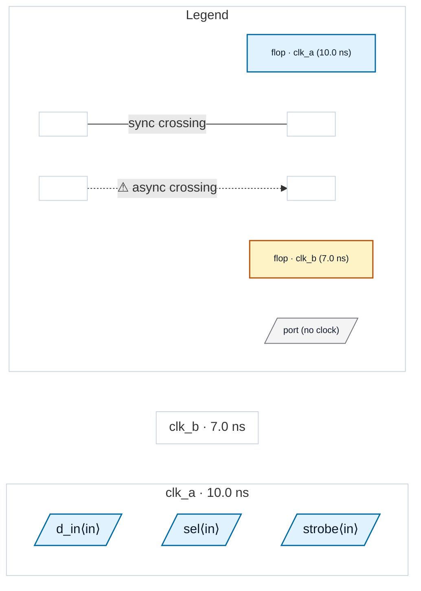

# Fixture: `bbx_residual_declines`

<!-- generator: scripts/gen_fixture_docs.py -->

Residual-decline fixture for compositional boundaries (rtl-buddy-cdc#261).

#261 lifts the #259 multi-clock and reconvergence declines, but not every shape can be summarised soundly even with the internals in hand. The three blocks here are the cases that must STILL decline (or still refuse to seed), each for a different, stated reason — a conservative decline carrying a `CDC-BBX` diagnostic is acceptable; silence is not.

```text
  * `oddclk` — SINGLE-clock by pin inspection (only `clk_a` is
    recognised as a clock pin) but its second flop is clocked from
    `strobe`, a port no clock-pin classifier accepts. Its internal
    clk_a -> strobe crossing is REAL. Before #261 the boundary was
    summarised as a clean single-clock block and that crossing
    vanished with no diagnostic — pin inspection cannot see it. With
    the internals present the flop lands in NO resolved domain, and a
    module the pass cannot fully domain-resolve is declined outright.
    This is a soundness catch the compositional pass ADDS.
```

```text
  * `twocap` — genuinely dual-clock, and its single data input `d_in`
    is captured in BOTH `clk_a` and `clk_b`. One virtual sink cannot
    stand for two capture domains and choosing either would drop the
    other's crossing, so it is declined with its own message.
```

```text
  * `feedthru` — the positive control for the same machinery. It is
    dual-clock and IS summarised: `d_in` is captured in `clk_a`,
    `y` is launched from `clk_b`, and `sel` — which nothing sequential
    captures — simply seeds no sink. There is no crossing INTO the
    block at `sel`; whatever it gates leaves through `y`, which is
    seeded as its own source.
```

Every clock in the SDC is async to every other, so nothing here is masked by a synchronous grouping.

- **Status:** auxiliary
- **Top module:** `bbx_residual_declines`
- **Clocks:** `clk_a` (10.0 ns), `clk_b` (7.0 ns)
- **Crossings:** 0 structural (0 async-per-SDC, 0 sync)

## Clock-domain map



## Files

- `bbx_residual_declines.flat.json`
- `bbx_residual_declines.grey.json`
- `bbx_residual_declines.json`
- `bbx_residual_declines.sdc`
- `bbx_residual_declines.sv`

---
*Generated by `scripts/gen_fixture_docs.py` — re-run after editing the SV/SDC/netlist.*
