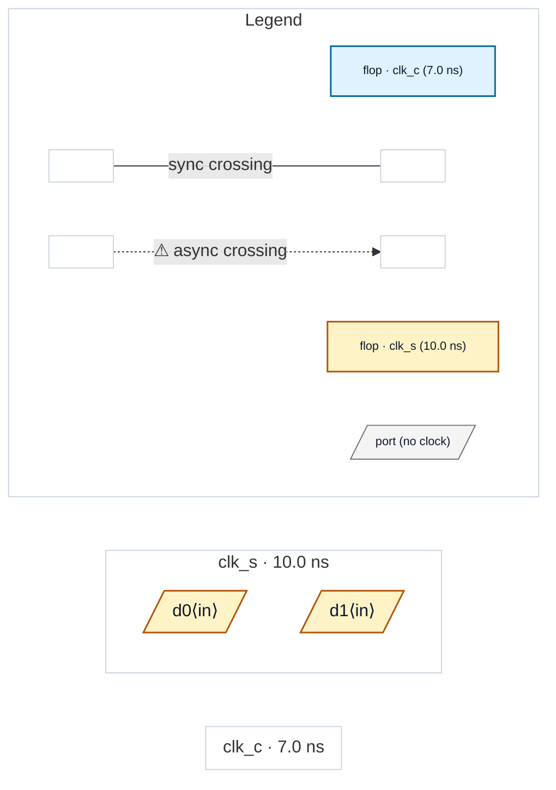

# Fixture: `bbx_shared_internal_violation`

<!-- generator: scripts/gen_fixture_docs.py -->

Analyse-once lifting fixture (rtl-buddy-cdc#261).

`xsync` is a genuinely DUAL-clock IP: it captures `d_in` in `clk_s`, hands the value across to `clk_c` through a two-stage synchroniser, and launches `d_out` from the chain's tail. Before #261 such a block was DECLINED outright — two clock roots meant "not provably single-clock", so every instance became an opaque CDC-BBX error and the internal clk_s -> clk_c crossing was never analysed at all.

It is instantiated TWICE, in the SAME clock context. That is the compositional contract the epic is about: the module is analysed ONCE (the summary cache keys on `(module type, clock-pin -> root mapping)`) and its internal finding is lifted into the parent's report ONCE, naming both instances — not once per instance, and not zero times.

The internal chain is exactly 2 deep, so it is clean at the default `--sync-depth 2` and raises CDC-002 at `--sync-depth 3`. The top level itself has no crossings at all: `d0` / `d1` are typed into clk_s and the outputs go nowhere, so every finding in this design comes from inside the boundary.

FLAT (`--sync-depth 3`): CDC-002 fires TWICE, once per inlined copy. GREYBOXED (`--sync-depth 3`): CDC-002 fires ONCE, attributed to `u_a, u_b`. Same hazard, reported once — and no CDC-BBX.

- **Status:** auxiliary
- **Top module:** `bbx_shared_internal_violation`
- **Clocks:** `clk_c` (7.0 ns), `clk_s` (10.0 ns)
- **Crossings:** 0 structural (0 async-per-SDC, 0 sync)

## Clock-domain map

## Files

- `bbx_shared_internal_violation.flat.json`
- `bbx_shared_internal_violation.grey.json`
- `bbx_shared_internal_violation.json`
- `bbx_shared_internal_violation.sdc`
- `bbx_shared_internal_violation.sv`

---
*Generated by `scripts/gen_fixture_docs.py` — re-run after editing the SV/SDC/netlist.*
