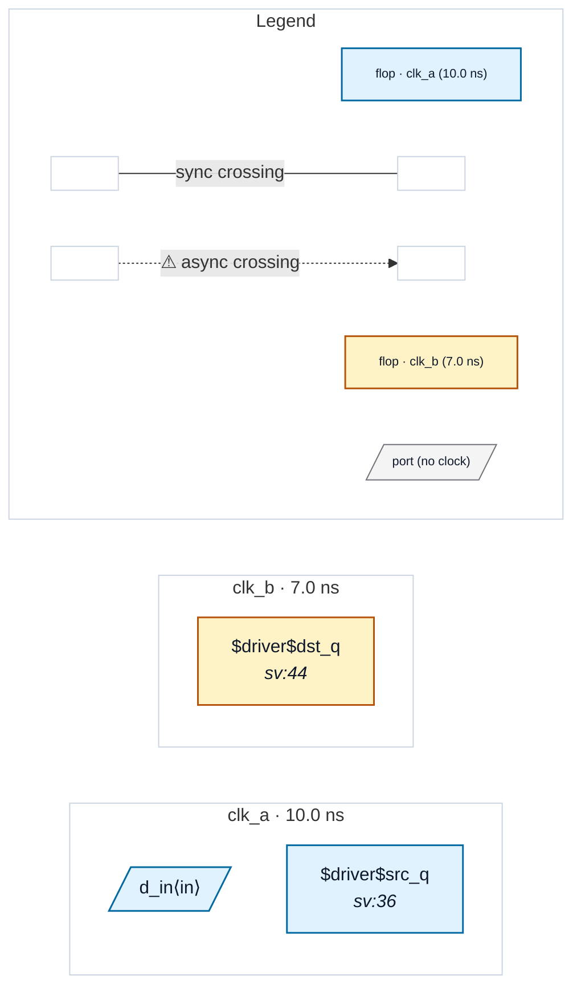

# Fixture: `blackbox_leaf_crossing`

<!-- generator: scripts/gen_fixture_docs.py -->

P1 blackbox boundary fixture (#255).

`top` drives a sub-block `leaf` from a clk_a flop and captures `leaf`'s output into a clk_b flop, so the data path runs THROUGH the blackbox: src_q (clk_a) -> leaf.d_in -> leaf.d_out -> dst_q (clk_b).

When `leaf` is blackboxed via `read_slang --blackboxed-module leaf`, it survives flatten with its real name + an `attributes.blackbox` flag and zero internals; the parent keeps `u_leaf` as an ordinary cell whose `type` is `leaf`. This is the boundary-cell topology netlist.load must accept (the single-module-after-flatten invariant is relaxed to "one top + N blackbox siblings").

`leaf` exposes a data-only port boundary (no clock pin) so the P0 boundary summariser (P2) can describe it purely by its data ports; P1 only proves the boundary loads and the analyzer runs over it.

- **Status:** auxiliary
- **Top module:** `blackbox_leaf_crossing`
- **Clocks:** `clk_a` (10.0 ns), `clk_b` (7.0 ns)
- **Crossings:** 0 structural (0 async-per-SDC, 0 sync)

## Clock-domain map

## Files

- `blackbox_leaf_crossing.json`
- `blackbox_leaf_crossing.sdc`
- `blackbox_leaf_crossing.sv`

---
*Generated by `scripts/gen_fixture_docs.py` — re-run after editing the SV/SDC/netlist.*
