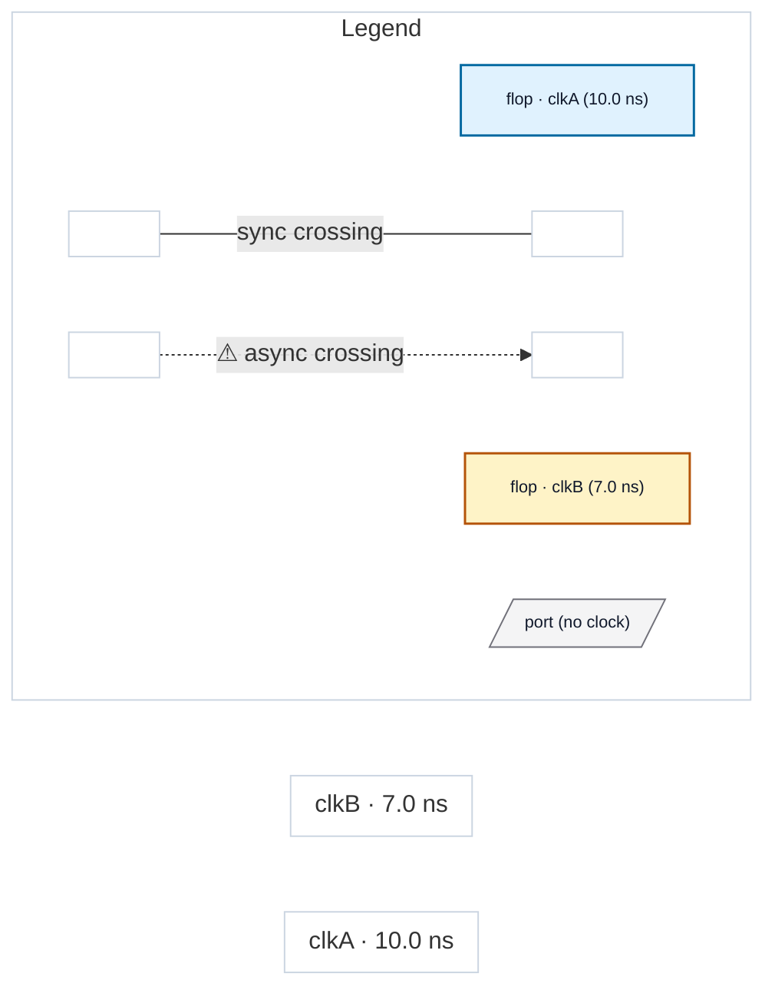

# Fixture: `clock_combine_gate`

<!-- generator: scripts/gen_fixture_docs.py -->

clock_combine_gate — a two-input gate that COMBINES two distinct declared clocks (clkA & clkB) into one net feeding a flop's clock. Like clock_combine_latch but the combining cell is a $and gate rather than a latch. The analyzer must DECLINE (domain-unknown) instead of silently picking one leg — issue #263. A normal clock GATE (clock + non-clock enable) still resolves; only a genuine two-declared-clock combine declines.

- **Status:** auxiliary
- **Top module:** `clock_combine_gate`
- **Clocks:** `clkA` (10.0 ns), `clkB` (7.0 ns)
- **Crossings:** 0 structural (0 async-per-SDC, 0 sync)

## Clock-domain map

## Files

- `clock_combine_gate.json`
- `clock_combine_gate.sdc`
- `clock_combine_gate.sv`

---
*Generated by `scripts/gen_fixture_docs.py` — re-run after editing the SV/SDC/netlist.*
