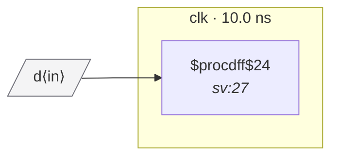

# Fixture: `clock_gating`

<!-- generator: scripts/gen_fixture_docs.py -->

Positive-case fixture: an integrated-clock-gate (ICG) drives a flop's CLK pin. The flop is still in the `clk` domain — the gate only suppresses some edges. The analyzer should resolve the gated clock back to its source port instead of marking the flop as "<unresolved>".

- **Status:** auxiliary
- **Top module:** `clock_gating`
- **Clocks:** `clk` (10.0 ns)
- **Crossings:** 0 structural (0 async-per-SDC, 0 sync)

## Clock-domain map

## Files

- `clock_gating.json`
- `clock_gating.sdc`
- `clock_gating.sv`

---
*Generated by `scripts/gen_fixture_docs.py` — re-run after editing the SV/SDC/netlist.*
