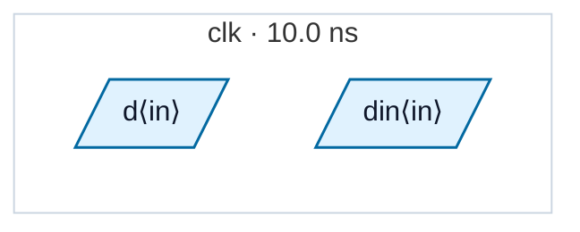

# Fixture: `clock_output_blackbox`

<!-- generator: scripts/gen_fixture_docs.py -->

Clock-output blackbox soundness fixture (rtl-buddy-cdc#273).

`clkfwd_tile` is SINGLE-CLOCK internally, so the pre-#273 boundary check happily accepted it as a `--blackbox` candidate. But it also has a CLOCK OUTPUT: `clk_out` forwards `clk_in` onward through `clk_buf`, and the next tile is clocked from it. Blackboxing the tile therefore elides the whole clock generation/forwarding network — the forwarded clock leaves an opaque boundary output, its downstream consumers go domain-unknown (or vanish with them), and the cells feeding the boundary lose their clock-distribution status.

`datapath_core` is the positive control: single-clock, data-only outputs. It must stay ACCEPTED (abstracted) — the clock-output decline must not over-fire on the common case.

FLAT: clean — `clk_out` is a buffered copy of `clk`, both tiles are in the one `clk` domain. BLACKBOXED (`--blackbox clkfwd_tile --blackbox datapath_core`): both `clkfwd_tile` instances are DECLINED with the clock-output flavour of CDC-BBX (the module-level verdict covers `u1`, whose own `clk_out` is unconnected), while `u_core` is still abstracted.

- **Status:** auxiliary
- **Top module:** `clock_output_blackbox`
- **Clocks:** `clk` (10.0 ns)
- **Crossings:** 0 structural (0 async-per-SDC, 0 sync)

## Clock-domain map

## Files

- `clock_output_blackbox.flat.json`
- `clock_output_blackbox.json`
- `clock_output_blackbox.sdc`
- `clock_output_blackbox.sv`

---
*Generated by `scripts/gen_fixture_docs.py` — re-run after editing the SV/SDC/netlist.*
