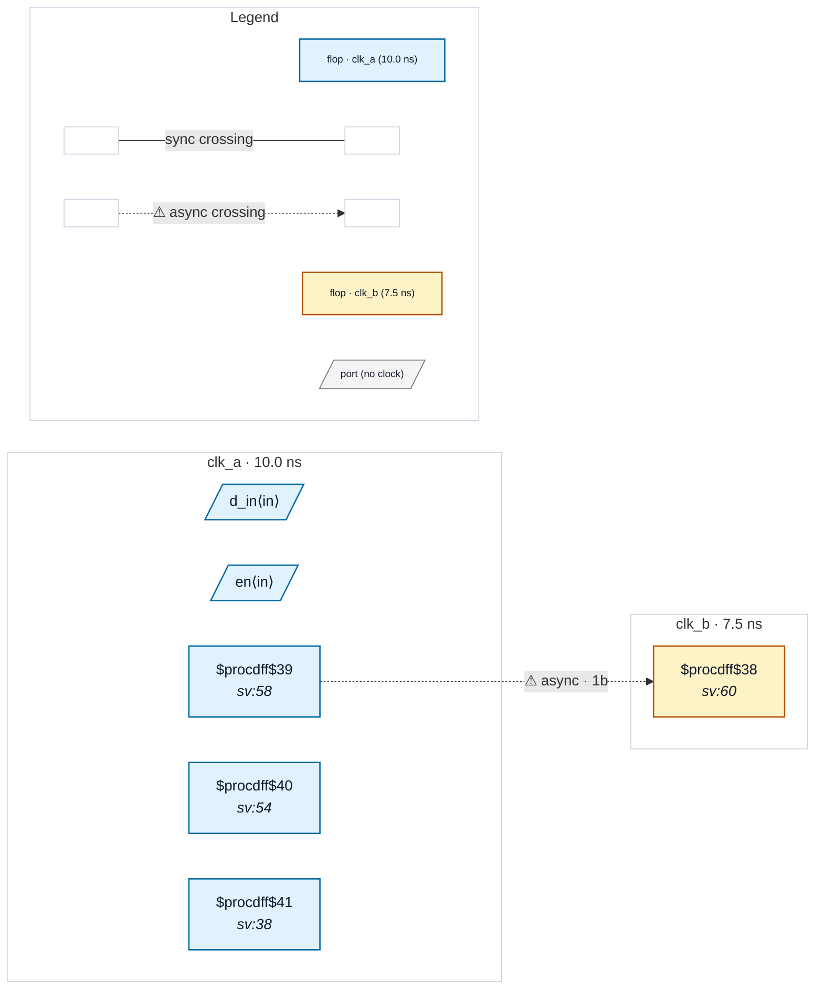

# Fixture: `clock_through_latch`

<!-- generator: scripts/gen_fixture_docs.py -->

Coverage fixture for issue #263 (P2) — a clock routed THROUGH a transparent latch now resolves to its upstream clock root, where it was domain-unknown before.

The clock-root tracer (domain.py `_trace`) follows buffers, two-input clock gates, muxes and flop-Q dividers. P2 adds the clock-path latch: when a flop's CLK net is driven by a `$dlatch` (or gate-level `$_DLATCH_*`) Q, the walk explores the latch's data pin (D) and enable pin (EN coarse / E gate-level), returning whichever leg resolves to a clock root.

Two ICG coding styles, both resolving to `clk_a`:

```text
  - D-leg: `always_latch if (en) gclk_d = clk_a;` puts the clock on the
    latch's D pin. `dq` is clocked by `gclk_d`.
  - EN-leg: a latch whose ENABLE is the (already-gated) clock and whose D is
    a steady level. `eq` is clocked by `gclk_en`. Modelled so the clock
    reaches the latch on the enable pin, exercising the EN/E exploration leg.
```

Both `dq` and `eq` therefore resolve to `clk_a` (they were domain-unknown at P0/P1). The design also carries a genuine clk_a -> clk_b crossing (`a_q` -> `b_q`, unsynchronised) whose endpoints resolve at any depth — the parity anchor proving the new latch tracing adds a resolved domain without perturbing the crossing the analyzer already sees.

- **Status:** auxiliary
- **Top module:** `clock_through_latch`
- **Clocks:** `clk_a` (10.0 ns), `clk_b` (7.5 ns)
- **Crossings:** 1 structural (1 async-per-SDC, 0 sync)

## Clock-domain map



## Files

- `clock_through_latch.json`
- `clock_through_latch.sdc`
- `clock_through_latch.sv`

---
*Generated by `scripts/gen_fixture_docs.py` — re-run after editing the SV/SDC/netlist.*
