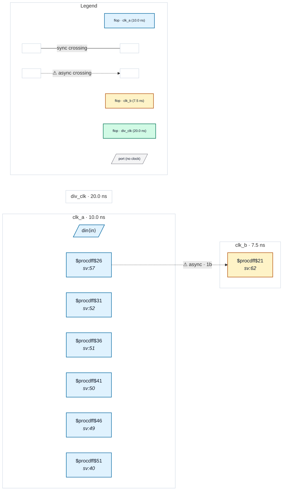

# Fixture: `declared_pin_clock`

<!-- generator: scripts/gen_fixture_docs.py -->

declared_pin_clock — an internal generated clock the user DID declare, with a plain `create_clock` aimed at the pin (issue #270).

Same shape as `inferred_fwd_clock`: `clk_div` is a divide-by-2 toggle flop on `clk_a` whose Q clocks a four-flop bank, so the net clears the advisory's >=4 CLK-pin fanout floor. The difference is the SDC, which declares that net directly:

```text
  create_clock -name div_clk -period 20.0 [get_pins clk_div]
```

That is a declaration, not a `create_generated_clock`, so the target lands in `Clock.ports` (reachable via `ClockSpec.clock_for_port`) and never in `ClockSpec.pin_clocks`. Before #270 the advisory consulted only `pin_clocks` plus the top-level input ports, so it re-reported a clock the user had already written down. `clk_div` must NOT appear in `inferred_clock_candidates`.

Advisory-only, as always: the bank flops resolve to `clk_a` through the divider trace either way, so no domain, crossing, or violation moves — this fixture pins the false positive, nothing else.

Parity anchor: `q_a` (clk_a) drives `q_b` (clk_b) directly across an async clock boundary — a genuine clk_a->clk_b crossing.

```text
Build:
  yosys -p 'read_verilog -sv declared_pin_clock.sv;
            hierarchy -top declared_pin_clock;
            proc; flatten;
            write_json declared_pin_clock.json'
```

- **Status:** auxiliary
- **Top module:** `declared_pin_clock`
- **Clocks:** `clk_a` (10.0 ns), `clk_b` (7.5 ns), `div_clk` (20.0 ns)
- **Crossings:** 1 structural (1 async-per-SDC, 0 sync)

## Clock-domain map



## Files

- `declared_pin_clock.json`
- `declared_pin_clock.sdc`
- `declared_pin_clock.sv`

---
*Generated by `scripts/gen_fixture_docs.py` — re-run after editing the SV/SDC/netlist.*
