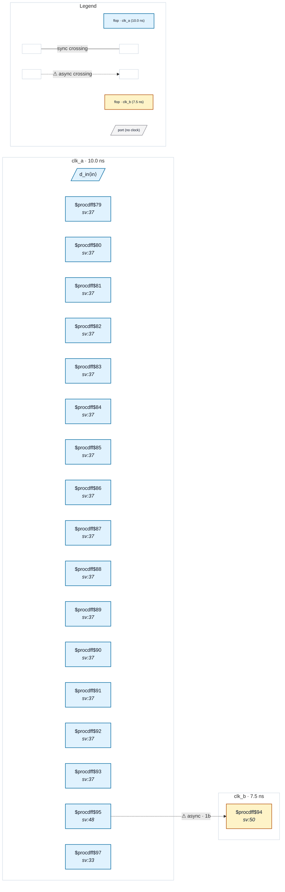

# Fixture: `deep_clock_divider_chain`

<!-- generator: scripts/gen_fixture_docs.py -->

Coverage fixture for issue #263 (P1) — a clock that reaches a flop only through a LONG chain of divider flops resolves to domain-unknown at the default trace depth (16) and RESOLVES once `--clock-trace-depth` is raised.

`clk_a` feeds a 30-stage ripple divider: each `div[i]` flop toggles on the rising edge of `div[i-1]` (its Q clocks the next stage). The deepest tap `div[29]` then clocks `deep_q`. The clock-root tracer (domain.py `_trace`) follows a flop-Q divider by recursing on that flop's CLK pin, costing one hop per stage — so reaching `clk_a` from `deep_q`'s CLK needs ~30 hops. At the default budget of 16 the walk gives up and `deep_q` is domain-unknown (counted in `summary.domain_unknown`). At `--clock-trace-depth 40` the same walk reaches `clk_a` and `deep_q` resolves to the `clk_a` domain — raising the budget only ever resolves MORE flops, never fewer.

The design also carries a genuine clk_a -> clk_b crossing (`a_q` -> `b_q`, unsynchronised) whose endpoints both resolve at ANY depth >= 1. That makes the fixture a parity anchor: the crossing/violation the analyzer sees must be byte-identical at depth 16 and depth 40 — the deeper walk adds a resolved domain, it does not perturb the crossing already found.

- **Status:** auxiliary
- **Top module:** `deep_clock_divider_chain`
- **Clocks:** `clk_a` (10.0 ns), `clk_b` (7.5 ns)
- **Crossings:** 1 structural (1 async-per-SDC, 0 sync)

## Clock-domain map

## Files

- `deep_clock_divider_chain.json`
- `deep_clock_divider_chain.sdc`
- `deep_clock_divider_chain.sv`

---
*Generated by `scripts/gen_fixture_docs.py` — re-run after editing the SV/SDC/netlist.*
