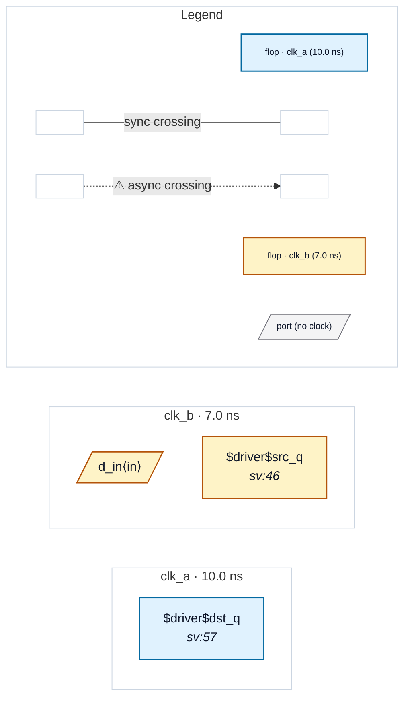

# Fixture: `foreign_input_no_abstract`

<!-- generator: scripts/gen_fixture_docs.py -->

P2 auto-abstract safety fixture: foreign-domain INPUT into a single-clock subtree must NOT be abstracted away (#256).

`top` runs two async clocks, clk_a and clk_b. The leaf `pipe` is a pure clk_a pipeline (two clk_a stages) — a SINGLE-CLOCK subtree by the clock-pin test. BUT here its `d_in` is driven by a clk_b parent flop (`src_q`), so the real async crossing (clk_b -> clk_a) lands on pipe's FIRST internal flop, *inside* the subtree's input boundary.

If P2 abstracted `pipe` to its output port boundary it would seed only an output-side virtual source (clk_a) and NO input-side virtual sink, so the clk_b -> clk_a input crossing would silently vanish — the flattened design reports it, the abstracted design would not.

The safety property: because a foreign-domain signal enters the subtree's data input, P2 must REFUSE to abstract `pipe` (until P3's dst_boundary input-sink seeding lands).

Known divergence (deferred to P3 — rtl-buddy-cdc#257). With the abstraction declined, `pipe` stays an opaque blackbox carrying zero cells, so the clk_b -> clk_a crossing that the FLATTENED design reports at pipe's first internal flop (CDC-004) is NOT yet preserved in the blackboxed run: the real crossing lands inside the boundary, and input-side virtual-sink (`dst_boundary`) seeding is still deferred. The blackboxed run is therefore *conservative but not result-preserving* for this case — it reports zero crossings and zero violations rather than the flat design's one CDC-004. It does NOT invent a spurious finding: CDC-008 is exempt on blackbox boundary instances (rtl-buddy-cdc#257 review), so the boundary clock pin is not mistaken for clock-as-data. Full parity returns when P3's dst_boundary input-sink seeding lands.

- **Status:** auxiliary
- **Top module:** `foreign_input_no_abstract`
- **Clocks:** `clk_a` (10.0 ns), `clk_b` (7.0 ns)
- **Crossings:** 0 structural (0 async-per-SDC, 0 sync)

## Clock-domain map

## Files

- `foreign_input_no_abstract.flat.json`
- `foreign_input_no_abstract.json`
- `foreign_input_no_abstract.sdc`
- `foreign_input_no_abstract.sv`

---
*Generated by `scripts/gen_fixture_docs.py` — re-run after editing the SV/SDC/netlist.*
