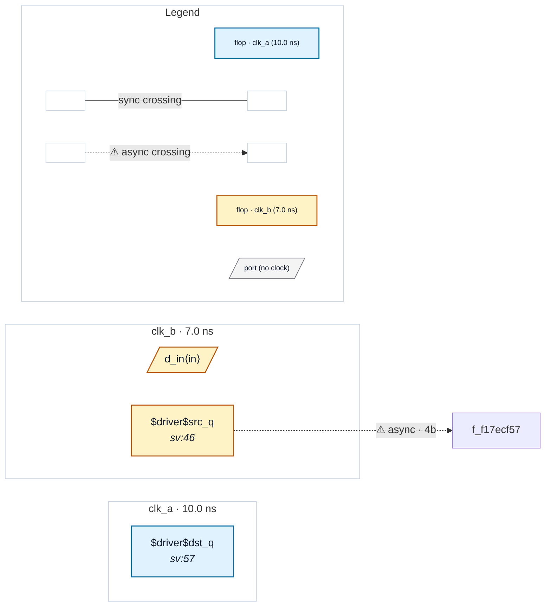

# Fixture: `foreign_input_no_abstract`

<!-- generator: scripts/gen_fixture_docs.py -->

P3 boundary input-sink parity fixture: a foreign-domain INPUT into a single-clock subtree is preserved across abstraction (#257).

`top` runs two async clocks, clk_a and clk_b. The leaf `pipe` is a pure clk_a pipeline (two clk_a stages) — a SINGLE-CLOCK subtree by the clock-pin test. Its `d_in` is driven by a clk_b parent flop (`src_q`), so the real async crossing (clk_b -> clk_a) lands on pipe's FIRST internal flop, *inside* the subtree's input boundary.

P2 originally REFUSED to abstract `pipe` here (an output-only summary could not represent the input-side crossing). P3 retires that refusal: the summariser now records `pipe`'s data INPUT ports in the boundary's own clock domain (clk_a), and `find_crossings` seeds a virtual SINK at the boundary input pin. So the clk_b -> clk_a crossing INTO the boundary is re-created (a `dst_boundary` crossing anchored on `u_pipe.d_in`) instead of vanishing.

Parity restored (rtl-buddy-cdc#257). The FLATTENED run (pipe inlined) and the BLACKBOXED run (pipe abstracted to its port boundary) now produce IDENTICAL violations and identical `summary.*` counts: both report exactly one CDC-004 (the unprotected 4-bit clk_b -> clk_a bus crossing) and one async crossing. The blackboxed run walks fewer flops (pipe's two internal stages are summarised away) yet preserves the finding. CDC-008 still does NOT false-fire: the boundary clock pin is distribution into the opaque subtree, never seeded as a data sink, so it is not mistaken for clock-as-data.

- **Status:** auxiliary
- **Top module:** `foreign_input_no_abstract`
- **Clocks:** `clk_a` (10.0 ns), `clk_b` (7.0 ns)
- **Crossings:** 1 structural (1 async-per-SDC, 0 sync)

## Clock-domain map

## Files

- `foreign_input_no_abstract.flat.json`
- `foreign_input_no_abstract.json`
- `foreign_input_no_abstract.sdc`
- `foreign_input_no_abstract.sv`

---
*Generated by `scripts/gen_fixture_docs.py` — re-run after editing the SV/SDC/netlist.*
