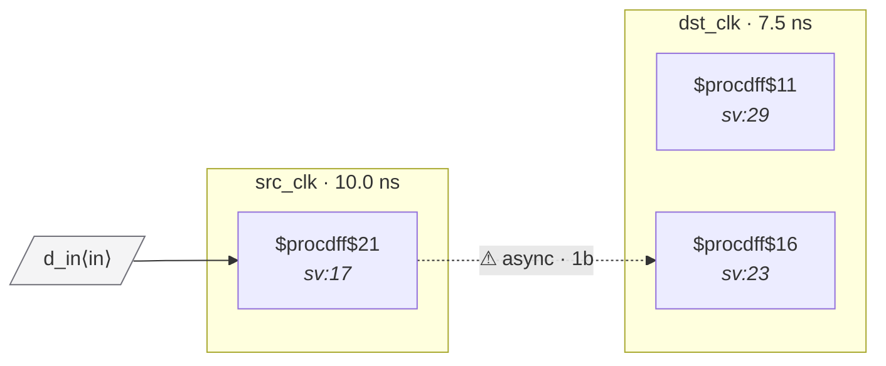

# Fixture: `good_2ff_sync`

<!-- generator: scripts/gen_fixture_docs.py -->

Positive counterpart to bad_single_ff_sync.

Standard 2FF level synchronizer. The source-domain flop is sampled by the destination's first sync stage (chain depth = 2), no combinational logic on the path. CDC-001 / CDC-002 / CDC-003 / CDC-005 all stay silent. The textbook minimum-correctness pattern.

- **Status:** positive — textbook fix; analyzer must stay silent
- **Top module:** `good_2ff_sync`
- **Clocks:** `dst_clk` (7.5 ns), `src_clk` (10.0 ns)
- **Crossings:** 1 structural (1 async-per-SDC, 0 sync)

## Clock-domain map

## Files

- `good_2ff_sync.json`
- `good_2ff_sync.sdc`
- `good_2ff_sync.sv`

---
*Generated by `scripts/gen_fixture_docs.py` — re-run after editing the SV/SDC/netlist.*
