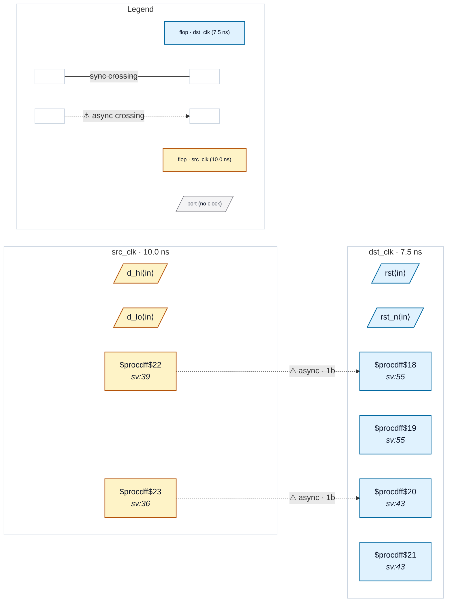

# Fixture: `good_2ff_sync_srst`

<!-- generator: scripts/gen_fixture_docs.py -->

Separate-flop 2FF synchroniser with a per-stage SYNCHRONOUS reset — the known follow-up from issue #301 (rtl-buddy-cdc#303). Same idiom as good_2ff_sync (`s1 <= src_q; s2 <= s1;`), but both stages live in an `always_ff` that also resets them to a constant on a destination-domain reset.

After `proc` each sync reset leaves a 1-bit `$mux` in front of the stage's `D`: the data on one leg, the constant on the other, the reset on `S`. The chain walker in `_sync_chain_depth` then saw `s1.Q` consumed by a non-flop cell and stopped at depth 1, and `_chain_has_inter_stage_comb` read that same reset mux as a *gate between the stages*, so CDC-014 fired on every instance.

Both reset polarities and both reset values are covered: `sync_hi` is reset active-HIGH to zero (data on the mux's A leg) and `sync_lo` active-LOW to one (data on the B leg). Both must stay silent — a synchronous reset is part of the flop, not logic on the path, and moves no data between the stages.

The slang frontend folds the same source into `$sdff` cells whose `D` is the data directly (CHANGELOG #86), so it was already silent; this fixture is the yosys-frontend half of that parity.

- **Status:** positive — textbook fix; analyzer must stay silent
- **Top module:** `good_2ff_sync_srst`
- **Clocks:** `dst_clk` (7.5 ns), `src_clk` (10.0 ns)
- **Crossings:** 2 structural (2 async-per-SDC, 0 sync)

## Clock-domain map

## Files

- `good_2ff_sync_srst.json`
- `good_2ff_sync_srst.sdc`
- `good_2ff_sync_srst.sv`

---
*Generated by `scripts/gen_fixture_docs.py` — re-run after editing the SV/SDC/netlist.*
