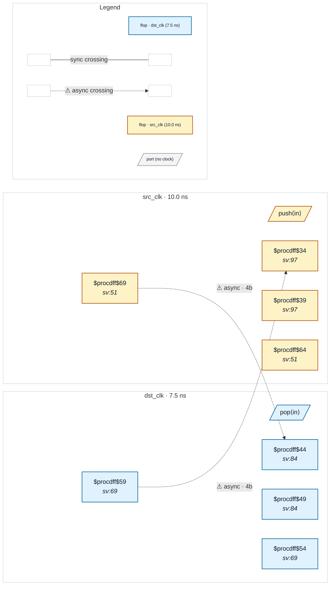

# Fixture: `good_async_fifo_gray_ptrs`

<!-- generator: scripts/gen_fixture_docs.py -->

Positive fixture (issue #170): canonical async-FIFO pointer pair.

Two pointers cross between asynchronous clock domains in opposite directions:

```text
  wptr_gray_q : src_clk → dst_clk  (full/empty comparison on dst)
  rptr_gray_q : dst_clk → src_clk  (full/empty comparison on src)
```

Both are Gray-coded — `g = b ^ (b >> 1)` — which guarantees at most one bit changes per source cycle. Each foreign pointer goes through a multi-bit 2FF synchroniser at the destination, so per- bit metastability is filtered. The Gray invariant guarantees any dst-side sample is a coherent value (the previous Gray code or the next, never a mid-flight mix). CDC-004 must accept the crossing via the structural Gray detector — no `(* cdc_gray *)` annotation needed.

This is the single most common multi-bit CDC idiom in production silicon. It exercises CDC-004 (structural Gray + multi-bit sync), CDC-005 (reconvergent fanout — the synced pointer feeds the comparator only, so the filter must let it pass), and CDC-001 on the implicit handshake structure all at once.

- **Status:** positive — textbook fix; analyzer must stay silent
- **Top module:** `good_async_fifo_gray_ptrs`
- **Clocks:** `dst_clk` (7.5 ns), `src_clk` (10.0 ns)
- **Crossings:** 2 structural (2 async-per-SDC, 0 sync)

## Clock-domain map



## Files

- `good_async_fifo_gray_ptrs.json`
- `good_async_fifo_gray_ptrs.sdc`
- `good_async_fifo_gray_ptrs.sv`

---
*Generated by `scripts/gen_fixture_docs.py` — re-run after editing the SV/SDC/netlist.*
