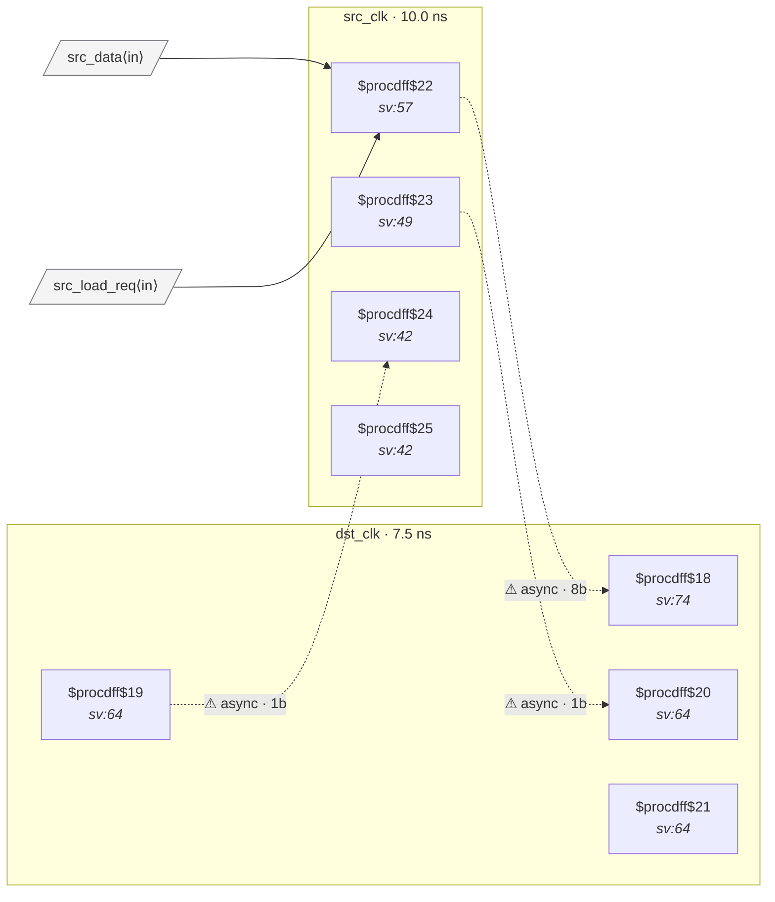

# Fixture: `good_buffered_gated_bus_crossing`

<!-- generator: scripts/gen_fixture_docs.py -->

good_buffered_gated_bus_crossing — mux-on-D gated bus crossing with a transparent buffer inserted between the gating mux and the destination flops.

Same correctness story as the standard mux-on-D handshake (the destination only latches the data when ``load_sync1`` agrees), with the fixture's JSON post-processed to splice a ``$_BUF_`` between the gating mux's ``Y`` output and the destination flops' ``D`` pins. CDC-004's shape-2 detector must follow the buffer hop and still recognise the originating mux.

The fixture also implements a full req/ack handshake on the src side so CDC-012 (functional data-hold) stays silent: the source payload is loaded only when arming a new request, held stable across the round-trip, and the request clears only when a synced-back ack confirms the destination has sampled.

```text
Build (two steps):
  1) Synthesize the base mux-on-D shape:
      yosys -q -p 'read_verilog -sv good_buffered_gated_bus_crossing.sv;
                   hierarchy -top good_buffered_gated_bus_crossing;
                   proc; flatten; opt_clean;
                   write_json good_buffered_gated_bus_crossing.json'
  2) Splice a ``$_BUF_`` between the load mux and each dst-flop
     D bit:
      python tests/fixtures/good_buffered_gated_bus_crossing/insert_buffer.py 1
     The argument is the number of buffer hops to insert (1 for
     the textbook good case, 3 for the budget-exceeded regression
     guard in ``test_rule_corners.py``).
```

- **Status:** positive — textbook fix; analyzer must stay silent
- **Top module:** `good_buffered_gated_bus_crossing`
- **Clocks:** `dst_clk` (7.5 ns), `src_clk` (10.0 ns)
- **Crossings:** 3 structural (3 async-per-SDC, 0 sync)

## Clock-domain map



## Files

- `good_buffered_gated_bus_crossing.json`
- `good_buffered_gated_bus_crossing.sdc`
- `good_buffered_gated_bus_crossing.sv`
- `insert_buffer.py`

---
*Generated by `scripts/gen_fixture_docs.py` — re-run after editing the SV/SDC/netlist.*
