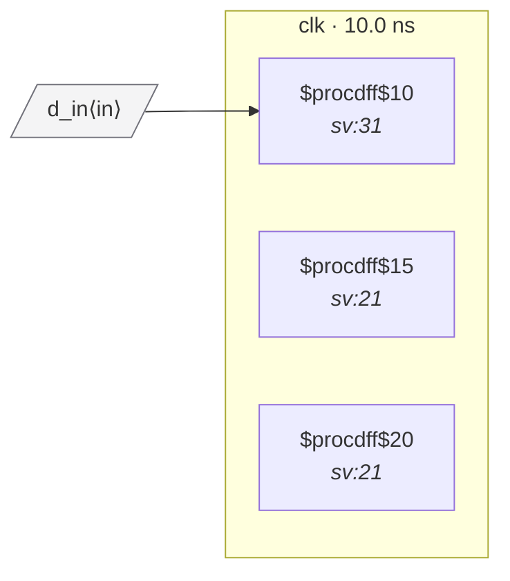

# Fixture: `good_derived_async_reset_synced`

<!-- generator: scripts/gen_fixture_docs.py -->

Positive counterpart for derived async reset deassertion.

The reset source is selected by a mux, then passed through a destination-clock reset synchronizer. Downstream logic uses the synchronized reset, so deassertion is aligned with clk.

- **Status:** positive — textbook fix; analyzer must stay silent
- **Top module:** `good_derived_async_reset_synced`
- **Clocks:** `clk` (10.0 ns)
- **Crossings:** 0 structural (0 async-per-SDC, 0 sync)

## Clock-domain map

## Files

- `good_derived_async_reset_synced.json`
- `good_derived_async_reset_synced.sdc`
- `good_derived_async_reset_synced.sv`

---
*Generated by `scripts/gen_fixture_docs.py` — re-run after editing the SV/SDC/netlist.*
