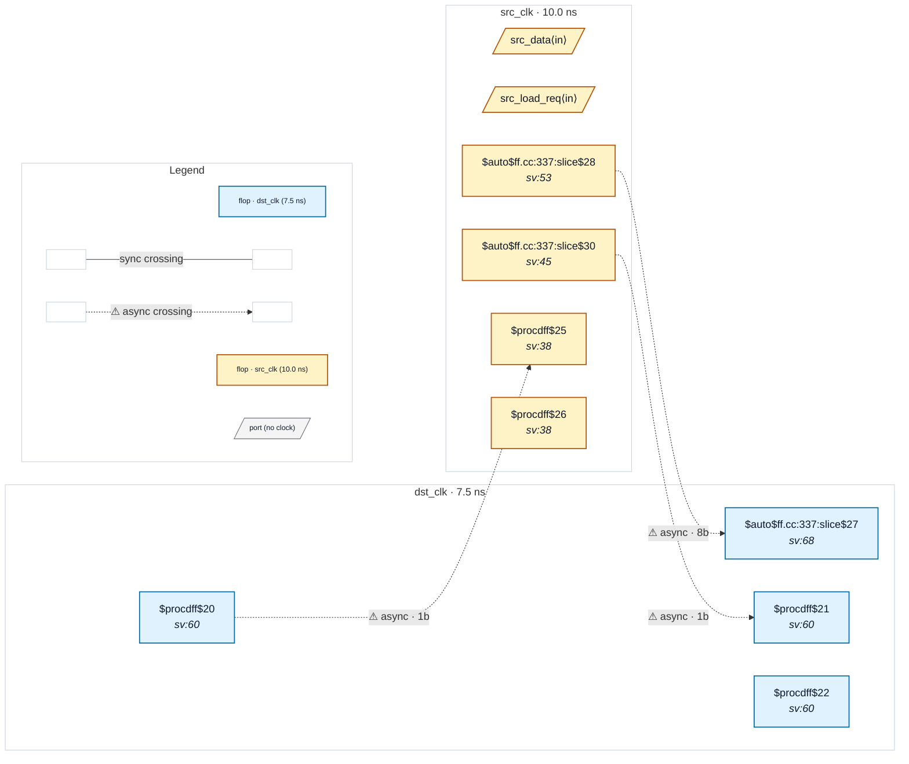

# Fixture: `good_dffe_gated_bus_crossing`

<!-- generator: scripts/gen_fixture_docs.py -->

good_dffe_gated_bus_crossing — bus crossing protected by a $dffe-style load enable.

The dst-side gating is a $dffe whose EN is the dst-side output of a 2FF synchroniser on the load-request bit. CDC-004's shape-1 detector accepts this as gated.

The fixture also implements a full req/ack handshake on the src side so CDC-012 (functional data-hold) stays silent: the source payload is loaded only when arming a new request, held stable across the round-trip, and the request clears only when a synced-back ack confirms the destination has sampled. Without the ack feedback, the payload could change between when the request is registered and when the destination latches it — the CDC-012 failure mode.

```text
Build:
  yosys -p 'read_verilog -sv good_dffe_gated_bus_crossing.sv;
            hierarchy -top good_dffe_gated_bus_crossing;
            proc; opt_dff; flatten;
            write_json good_dffe_gated_bus_crossing.json'
The non-default ``opt_dff`` pass coerces Yosys to fold the
hold-mux back into a ``$dffe`` cell. Without it Yosys leaves the
design as ``$dff`` + ``$mux``, which the CDC-004 shape-2 detector
would also accept — defeating the fixture's purpose.
```

- **Status:** positive — textbook fix; analyzer must stay silent
- **Top module:** `good_dffe_gated_bus_crossing`
- **Clocks:** `dst_clk` (7.5 ns), `src_clk` (10.0 ns)
- **Crossings:** 3 structural (3 async-per-SDC, 0 sync)

## Clock-domain map



## Files

- `good_dffe_gated_bus_crossing.json`
- `good_dffe_gated_bus_crossing.sdc`
- `good_dffe_gated_bus_crossing.sv`

---
*Generated by `scripts/gen_fixture_docs.py` — re-run after editing the SV/SDC/netlist.*
