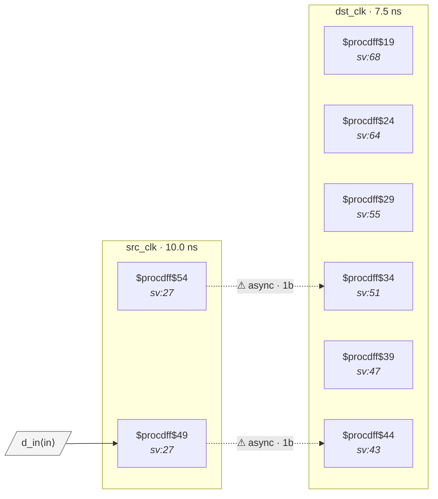

# Fixture: `good_disjoint_fanout_sync_chains`

<!-- generator: scripts/gen_fixture_docs.py -->

Positive-case fixture: redundant synchronizers WITHOUT downstream recombination.

A single source-domain flop fans out to two independent 2FF synchronizer chains in the destination domain — same shape as bad_reconvergent_sync.sv — BUT the two synchronized outputs drive disjoint downstream registers and disjoint output ports. There's no cell that observes both synchronized values together, so the mismatched-resolution failure mode the rule guards against cannot actually be triggered.

Phase 2 of CDC-005 (issue #33) introduces a forward-cone reconvergence filter: it should classify this fixture as harmless and NOT fire, while keeping the bad_reconvergent_sync fixture firing.

- **Status:** positive — textbook fix; analyzer must stay silent
- **Top module:** `good_disjoint_fanout_sync_chains`
- **Clocks:** `dst_clk` (7.5 ns), `src_clk` (10.0 ns)
- **Crossings:** 2 structural (2 async-per-SDC, 0 sync)

## Clock-domain map

## Files

- `good_disjoint_fanout_sync_chains.json`
- `good_disjoint_fanout_sync_chains.sdc`
- `good_disjoint_fanout_sync_chains.sv`

---
*Generated by `scripts/gen_fixture_docs.py` — re-run after editing the SV/SDC/netlist.*
