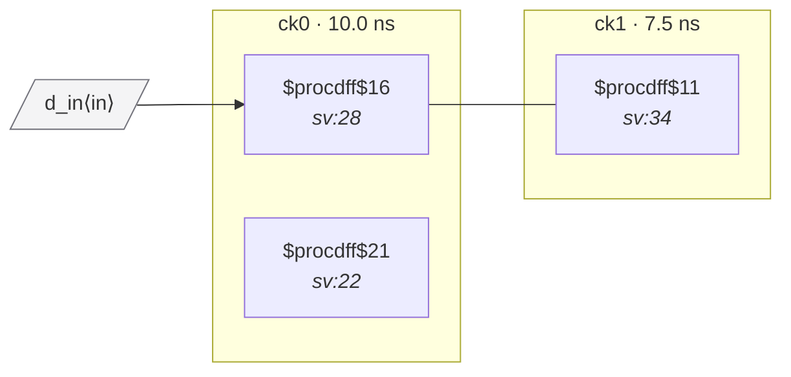

# Fixture: `good_exclusive_clock_mux`

<!-- generator: scripts/gen_fixture_docs.py -->

Positive fixture for set_clock_groups -physically_exclusive.

Two clock ports drive separate flops with a flop→flop wire between them. ck0 and ck1 are declared async AND physically_exclusive — the user is asserting that although the static netlist looks like a CDC crossing, only one of the two clocks is active in any power state, so the path is unreachable and must not be checked.

Without the exclusive declaration this would fire CDC-001 (no synchronizer). With it, the analyzer drops the crossing in _filter_async before the rule pack sees it, so 0 violations.

- **Status:** positive — textbook fix; analyzer must stay silent
- **Top module:** `good_exclusive_clock_mux`
- **Clocks:** `ck0` (10.0 ns), `ck1` (7.5 ns)
- **Crossings:** 1 structural (0 async-per-SDC, 1 sync)

## Clock-domain map

## Files

- `good_exclusive_clock_mux.json`
- `good_exclusive_clock_mux.sdc`
- `good_exclusive_clock_mux.sv`

---
*Generated by `scripts/gen_fixture_docs.py` — re-run after editing the SV/SDC/netlist.*
