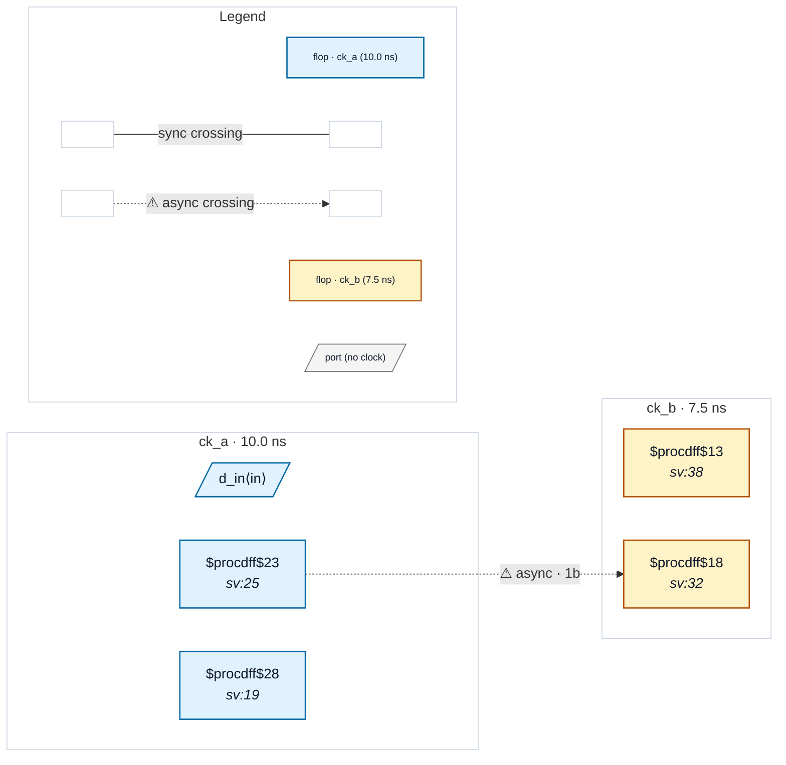

# Fixture: `good_false_path_pair`

<!-- generator: scripts/gen_fixture_docs.py -->

Positive fixture for set_false_path -from -to as an async hint.

Two unrelated clock domains, ck_a and ck_b, with a flop→flop wire between them. The SDC declares the pair as a false-path (no set_clock_groups -asynchronous needed) — the analyzer treats this as equivalent to declaring them async and the rule pack runs as usual. With a proper 2FF synchronizer in place, no violation fires.

- **Status:** positive — textbook fix; analyzer must stay silent
- **Top module:** `good_false_path_pair`
- **Clocks:** `ck_a` (10.0 ns), `ck_b` (7.5 ns)
- **Crossings:** 1 structural (1 async-per-SDC, 0 sync)

## Clock-domain map

## Files

- `good_false_path_pair.json`
- `good_false_path_pair.sdc`
- `good_false_path_pair.sv`

---
*Generated by `scripts/gen_fixture_docs.py` — re-run after editing the SV/SDC/netlist.*
