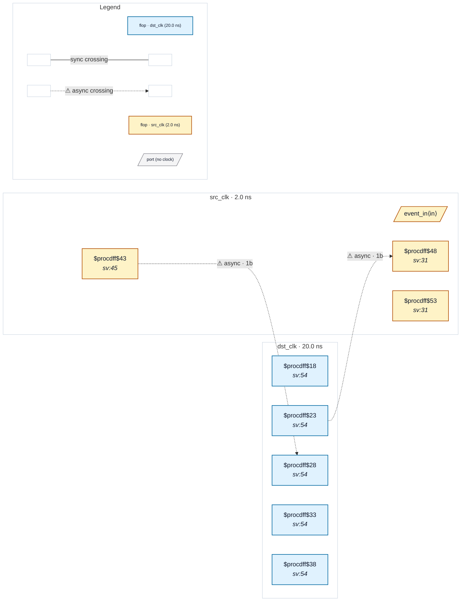

# Fixture: `good_fast_to_slow_handshake`

<!-- generator: scripts/gen_fixture_docs.py -->

Positive counterpart to bad_fast_to_slow_control_loss (CDC-013).

Same fast-to-slow clock ratio (src_clk 2.0ns, dst_clk 20.0ns), and the same goal of forwarding a single event from the fast domain to the slow domain. Where the bad fixture toggles a level and risks losing event accounting when two events occur between dst samples, this one holds the request until the destination acknowledges it (synced back through a 2FF chain). The source's enable that re-arms a new request waits for an ack, so a second event cannot be issued before the first has been observed.

CDC-013 must NOT fire — the src request flop's D is a priority- encoded $mux nest (one branch sets on req_in, another clears on synced ack, the default holds), not the Q/~Q toggle shape the classifier matches.

Two async crossings (the synced-back ack and the held request).

- **Status:** positive — textbook fix; analyzer must stay silent
- **Top module:** `good_fast_to_slow_handshake`
- **Clocks:** `dst_clk` (20.0 ns), `src_clk` (2.0 ns)
- **Crossings:** 2 structural (2 async-per-SDC, 0 sync)

## Clock-domain map

## Files

- `good_fast_to_slow_handshake.json`
- `good_fast_to_slow_handshake.sdc`
- `good_fast_to_slow_handshake.sv`

---
*Generated by `scripts/gen_fixture_docs.py` — re-run after editing the SV/SDC/netlist.*
