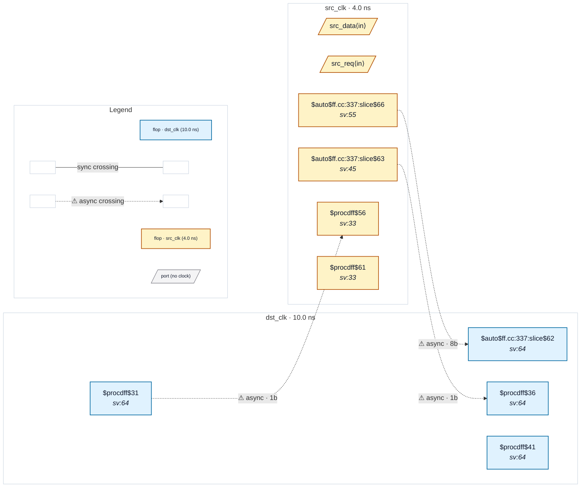

# Fixture: `good_functional_datahold_handshake`

<!-- generator: scripts/gen_fixture_docs.py -->

Positive counterpart to bad_functional_datahold_enable (CDC-012).

Same gated-bus crossing topology — src registers a payload and a request, dst syncs the request and captures the payload on the synced enable — but with the data-hold issue fixed via a textbook req/ack handshake:

```text
  - dst_ack is set when the destination has sampled the payload.
  - dst_ack is 2FF-synced back into the src domain (ack_sync).
  - src_load_q is set on src_req and cleared only on ack_sync.
  - src_payload is loaded only when *arming* a new request
    (src_req high, no current request in flight, no ack pending);
    once armed, it holds stable across the entire round-trip.
```

CDC-012 must NOT fire — the existence of a src-domain flop (ack_meta / ack_sync) whose D-pin fanin reaches a dst-domain flop's Q (dst_ack) is the structural marker of the handshake. CDC-004 stays silent for the same reason as bad fixture: the dst data flop is a $dffe gated by load_sync1.

- **Status:** positive — textbook fix; analyzer must stay silent
- **Top module:** `good_functional_datahold_handshake`
- **Clocks:** `dst_clk` (10.0 ns), `src_clk` (4.0 ns)
- **Crossings:** 3 structural (3 async-per-SDC, 0 sync)

## Clock-domain map



## Files

- `good_functional_datahold_handshake.json`
- `good_functional_datahold_handshake.sdc`
- `good_functional_datahold_handshake.sv`

---
*Generated by `scripts/gen_fixture_docs.py` — re-run after editing the SV/SDC/netlist.*
