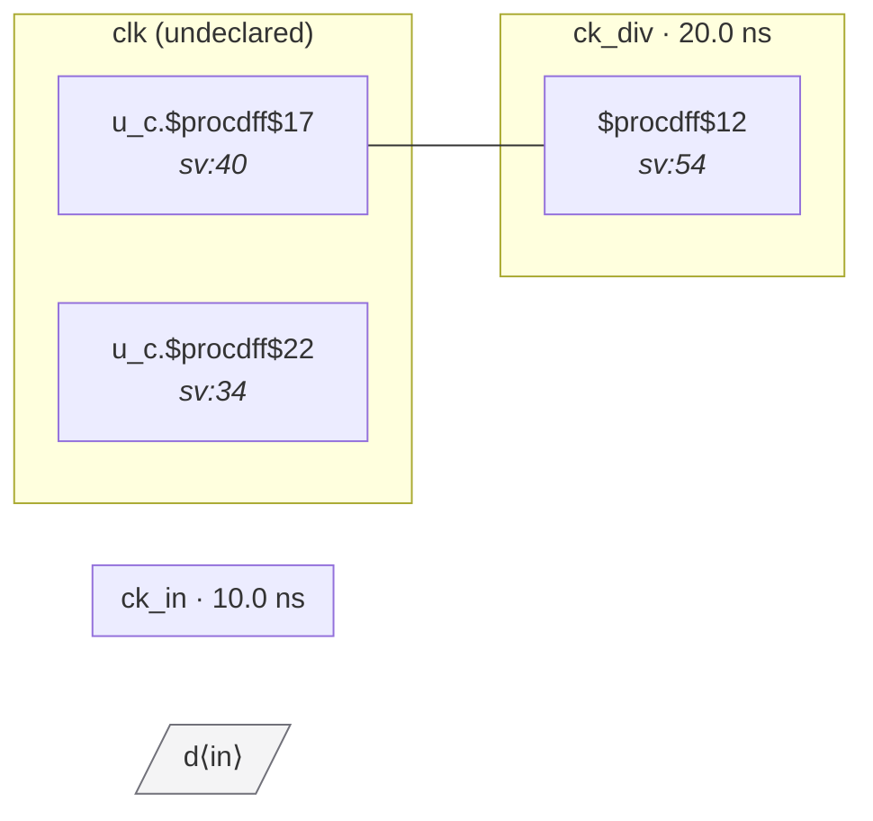

# Fixture: `good_gen_clock_internal_pin`

<!-- generator: scripts/gen_fixture_docs.py -->

Regression fixture for issue #15: gen-clock target on a child instance's output port pin must resolve under both frontends.

The child module's output port is driven by an internal divider flop via a continuous assign. After flattening, the SDC's `[get_pins u_c/clk_out]` must resolve to a netname that the `_build_bit_to_clock` lookup can find. Yosys-flatten + opt_clean preserves both the port netname (`u_c.clk_out`) and the driver (`u_c.div`) as aliases of the same bits; the slang frontend originally only emitted the driver, which silently dropped the gen-clock and collapsed the downstream flop's domain back to `ck_in`. This fixture exists to prevent that regression.

Topology: a 1-deep clock-divider chain with one downstream flop.

```text
  ck_in ──► u_c (div2) ──► ck_div ──► q_out
               ▲
               │ create_generated_clock at u_c/clk_out
```

```text
Expected (under both frontends):
  - 3 flops total (2 on ck_in inside u_c, 1 on ck_div for q_out).
  - 2 cross-domain crossings detected (the div feedback + the data
    hop into q_out).
  - 0 violations (synchronous via -master_clock chain back to ck_in).
```

- **Status:** positive — textbook fix; analyzer must stay silent
- **Top module:** `good_gen_clock_internal_pin`
- **Clocks:** `ck_div` (20.0 ns), `ck_in` (10.0 ns)
- **Crossings:** 2 structural (0 async-per-SDC, 2 sync)

## Clock-domain map



## Files

- `good_gen_clock_internal_pin.sdc`
- `good_gen_clock_internal_pin.sv`

---
*Generated by `scripts/gen_fixture_docs.py` — re-run after editing the SV/SDC/netlist.*
