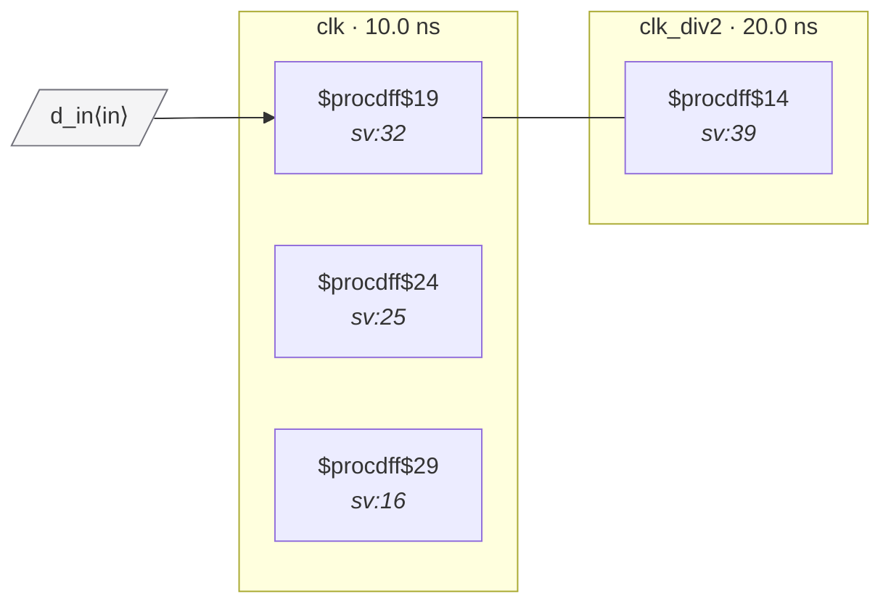

# Fixture: `good_generated_clock_div2`

<!-- generator: scripts/gen_fixture_docs.py -->

Positive fixture: a /2 clock divider declared via create_generated_clock. The downstream flop runs in clk_div2 (the divider's Q), and a flop in clk hands data to it. Because clk and clk_div2 share a master, are_async() must return false for the pair — no CDC violation should fire.

- **Status:** positive — textbook fix; analyzer must stay silent
- **Top module:** `good_generated_clock_div2`
- **Clocks:** `clk` (10.0 ns), `clk_div2` (20.0 ns)
- **Crossings:** 1 structural (0 async-per-SDC, 1 sync)

## Clock-domain map

## Files

- `good_generated_clock_div2.json`
- `good_generated_clock_div2.sdc`
- `good_generated_clock_div2.sv`

---
*Generated by `scripts/gen_fixture_docs.py` — re-run after editing the SV/SDC/netlist.*
