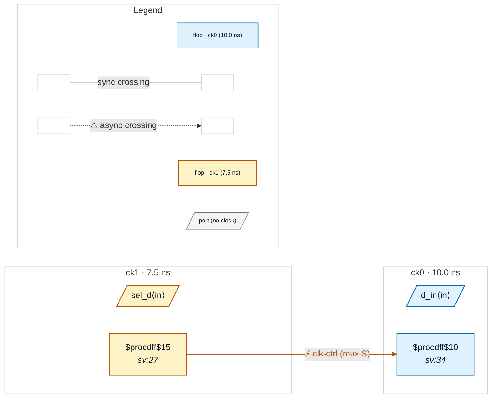

# Fixture: `good_glitchless_mux_marked`

<!-- generator: scripts/gen_fixture_docs.py -->

Positive counterpart to bad_async_clock_mux.

Same simple 2:1 clock mux with a foreign-domain select, but the user marks the select wire with (* glitchless_clock_mux *) to vouch that the surrounding mux topology is glitch-free (e.g. an external cross-coupled-latch envelope or a foundry library cell that handles the safe handoff). The "synchronise the select" fix CDC-010 normally proposes would break a correctly-built glitchless mux by introducing a single-clock dependency that defeats the other-clock-aware gating.

CDC-010 must stay silent on the marked select. The downstream flop driven by the muxed clock is otherwise identical to bad_async_clock_mux.

- **Status:** positive — textbook fix; analyzer must stay silent
- **Top module:** `good_glitchless_mux_marked`
- **Clocks:** `ck0` (10.0 ns), `ck1` (7.5 ns)
- **Crossings:** 0 structural (0 async-per-SDC, 0 sync)

## Clock-domain map

## Files

- `good_glitchless_mux_marked.json`
- `good_glitchless_mux_marked.sdc`
- `good_glitchless_mux_marked.sv`

---
*Generated by `scripts/gen_fixture_docs.py` — re-run after editing the SV/SDC/netlist.*
