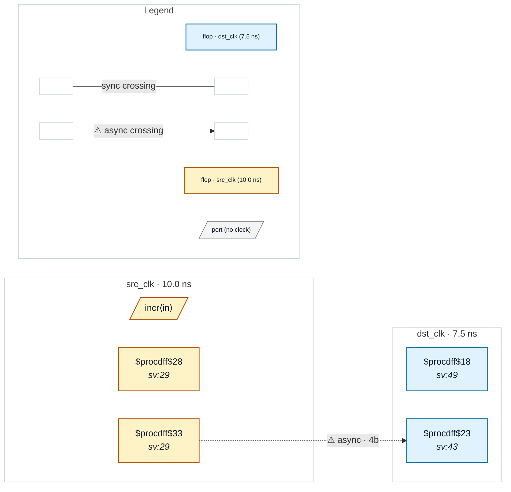

# Fixture: `good_gray_bus_sync_chain`

<!-- generator: scripts/gen_fixture_docs.py -->

Positive coverage for CDC-004's structural-gray-coded acceptance.

A 4-bit gray-coded counter increments freely in src_clk and is sampled by an *ungated* 4-bit 2FF synchronizer in dst_clk. The destination samples every cycle — there is no handshake or load enable — so the only thing keeping this bus correct is the gray encoding. CDC-004's structural detector pairs the canonical `g = b ^ (b >> 1)` pattern at the source with the multi-bit sync chain at the destination (rules.py `_is_multibit_sync_first_stage` + `_is_gray_encoded_source`) and must not fire.

Paired with the gated counterpart `good_gray_counter_crossing` and with the negative `bad_bus_crossing`.

- **Status:** positive — textbook fix; analyzer must stay silent
- **Top module:** `good_gray_bus_sync_chain`
- **Clocks:** `dst_clk` (7.5 ns), `src_clk` (10.0 ns)
- **Crossings:** 1 structural (1 async-per-SDC, 0 sync)

## Clock-domain map

## Files

- `good_gray_bus_sync_chain.json`
- `good_gray_bus_sync_chain.sdc`
- `good_gray_bus_sync_chain.sv`

---
*Generated by `scripts/gen_fixture_docs.py` — re-run after editing the SV/SDC/netlist.*
