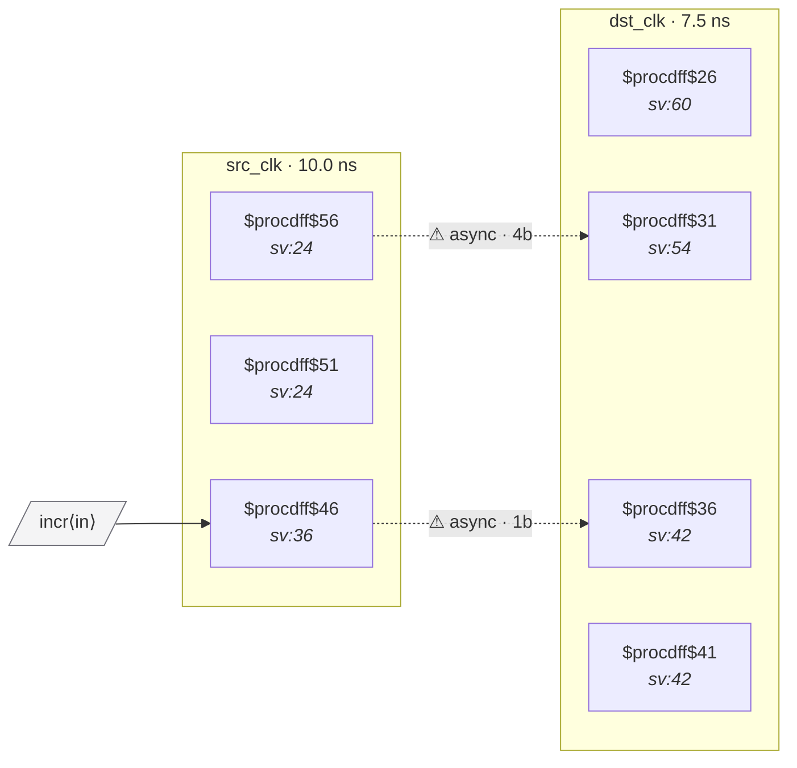

# Fixture: `good_gray_counter_crossing`

<!-- generator: scripts/gen_fixture_docs.py -->

Positive counterpart to bad_bus_crossing for the gray-code path.

A 4-bit gray-coded counter increments in src_clk and is sampled by a 4-bit 2FF synchronizer in dst_clk. Each individual bit is filtered for metastability by the synchronizer; the gray encoding guarantees at most one bit flips per source cycle, so the sampled value is always either the previous gray value or the next — never a transient mix. CDC-004 must not fire.

- **Status:** positive — textbook fix; analyzer must stay silent
- **Top module:** `good_gray_counter_crossing`
- **Clocks:** `dst_clk` (7.5 ns), `src_clk` (10.0 ns)
- **Crossings:** 2 structural (2 async-per-SDC, 0 sync)

## Clock-domain map

## Files

- `good_gray_counter_crossing.json`
- `good_gray_counter_crossing.sdc`
- `good_gray_counter_crossing.sv`

---
*Generated by `scripts/gen_fixture_docs.py` — re-run after editing the SV/SDC/netlist.*
