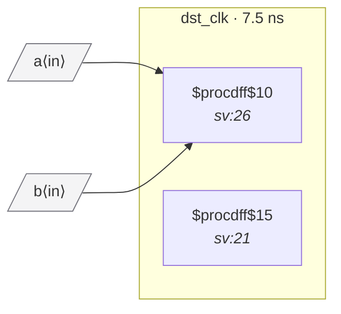

# Fixture: `good_input_delay_domain`

<!-- generator: scripts/gen_fixture_docs.py -->

Positive fixture for set_input_delay -clock <my_clk> port-typing.

A 2FF synchronizer in dst_clk has its D pin driven by combinational logic of two top-level inputs. Without an SDC declaration this would fire CDC-006 (the synchronizer is sampling a comb output of unregistered inputs). But the SDC declares both inputs as being in dst_clk's domain via set_input_delay, asserting they're already synchronous to dst_clk — so CDC-006 must not fire.

- **Status:** positive — textbook fix; analyzer must stay silent
- **Top module:** `good_input_delay_domain`
- **Clocks:** `dst_clk` (7.5 ns)
- **Crossings:** 0 structural (0 async-per-SDC, 0 sync)

## Clock-domain map

## Files

- `good_input_delay_domain.json`
- `good_input_delay_domain.sdc`
- `good_input_delay_domain.sv`

---
*Generated by `scripts/gen_fixture_docs.py` — re-run after editing the SV/SDC/netlist.*
