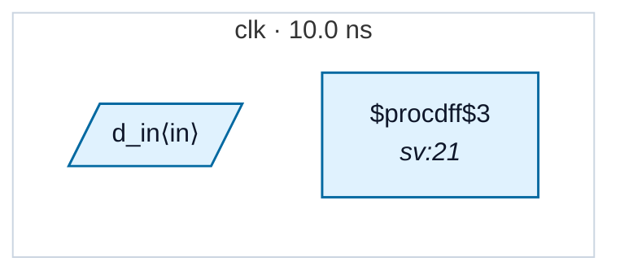

# Fixture: `good_marked_reset_polarity`

<!-- generator: scripts/gen_fixture_docs.py -->

Positive-case fixture for RDC-002's port-declared-polarity variant.

Same shape as `bad_marked_reset_polarity` but the flop is wired `negedge rst_n`, agreeing with the port's `(* reset_polarity = "low" *)` declaration. The analyzer sees:

```text
  port-declared polarity  = low  (asserts on '0')
  flop ARST_POLARITY       = 0   (asserts on '0')
```

— they match, so no RDC-002 violation. This pairs with the bad fixture as the regression net for the new check.

- **Status:** positive — textbook fix; analyzer must stay silent
- **Top module:** `good_marked_reset_polarity`
- **Clocks:** `clk` (10.0 ns)
- **Crossings:** 0 structural (0 async-per-SDC, 0 sync)

## Clock-domain map



## Files

- `good_marked_reset_polarity.json`
- `good_marked_reset_polarity.sdc`
- `good_marked_reset_polarity.sv`

---
*Generated by `scripts/gen_fixture_docs.py` — re-run after editing the SV/SDC/netlist.*
