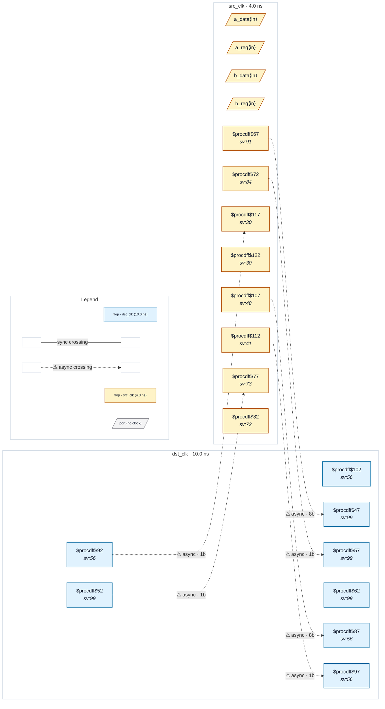

# Fixture: `good_mixed_handshake_datahold`

<!-- generator: scripts/gen_fixture_docs.py -->

Positive counterpart to bad_mixed_handshake_datahold (CDC-012, rtl-buddy-cdc#239).

Two independent multi-bit gated-bus crossings share the same src_clk -> dst_clk async pair, and BOTH are textbook req/ack handshakes — each source holds its payload until a synced-back ack proves the destination has sampled. CDC-012 must stay silent on both channels.

Paired with the bad fixture, this pins the per-crossing feedback scoping from both sides: the bad fixture proves a broken channel still fires next to a good one; this proves two good channels in the same domain pair don't false-fire on each other.

- **Status:** positive — textbook fix; analyzer must stay silent
- **Top module:** `good_mixed_handshake_datahold`
- **Clocks:** `dst_clk` (10.0 ns), `src_clk` (4.0 ns)
- **Crossings:** 6 structural (6 async-per-SDC, 0 sync)

## Clock-domain map

## Files

- `good_mixed_handshake_datahold.json`
- `good_mixed_handshake_datahold.sdc`
- `good_mixed_handshake_datahold.sv`

---
*Generated by `scripts/gen_fixture_docs.py` — re-run after editing the SV/SDC/netlist.*
