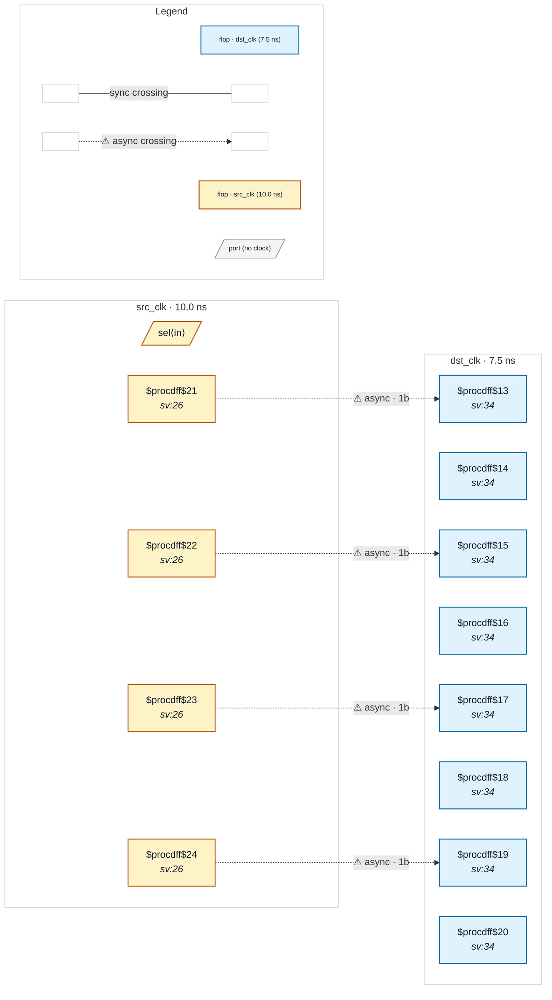

# Fixture: `good_onehot_decode_gray_marked`

<!-- generator: scripts/gen_fixture_docs.py -->

Positive counterpart to bad_onehot_decode_independent_sync.

Same shared-decoder shape, but the four source-domain registering flops are marked `(* cdc_gray *)` — the user vouches that the multi-bit coherence is handled by other means (e.g. only one bit changes per src cycle, or the dst-side recombines via an explicitly-marked sync). CDC-019 must stay silent on this shape.

- **Status:** positive — textbook fix; analyzer must stay silent
- **Top module:** `good_onehot_decode_gray_marked`
- **Clocks:** `dst_clk` (7.5 ns), `src_clk` (10.0 ns)
- **Crossings:** 4 structural (4 async-per-SDC, 0 sync)

## Clock-domain map

## Files

- `good_onehot_decode_gray_marked.json`
- `good_onehot_decode_gray_marked.sdc`
- `good_onehot_decode_gray_marked.sv`

---
*Generated by `scripts/gen_fixture_docs.py` — re-run after editing the SV/SDC/netlist.*
