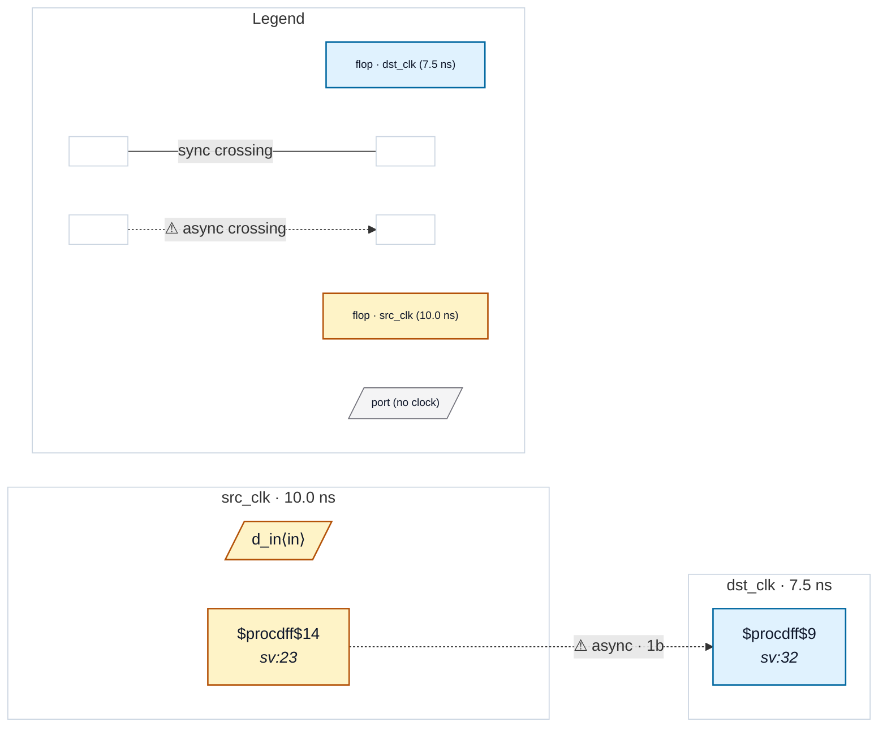

# Fixture: `good_packed_shift_sync`

<!-- generator: scripts/gen_fixture_docs.py -->

Packed-shift-register synchronizer — the false-positive case from issue #264. A 2-FF level synchronizer written as a single `reg [1:0]` that shifts (`sync_sr <= {sync_sr[0], src_q}`) instead of two separate flops, with the synchronized value tapped from the top bit. After `proc; flatten` this lowers to one multi-bit `$dff`, so the stage-to-stage movement is intra-cell — there are no inter-cell D->Q hops to follow.

The packed form is logically identical to the separate-flop form in good_2ff_sync (chain depth = 2). It must stay silent on CDC-001 / CDC-002 / CDC-003 just the same; before #264 the depth walk stopped at the multi-bit head and reported depth 1, firing a false CDC-001.

- **Status:** positive — textbook fix; analyzer must stay silent
- **Top module:** `good_packed_shift_sync`
- **Clocks:** `dst_clk` (7.5 ns), `src_clk` (10.0 ns)
- **Crossings:** 1 structural (1 async-per-SDC, 0 sync)

## Clock-domain map

## Files

- `good_packed_shift_sync.json`
- `good_packed_shift_sync.sdc`
- `good_packed_shift_sync.sv`

---
*Generated by `scripts/gen_fixture_docs.py` — re-run after editing the SV/SDC/netlist.*
