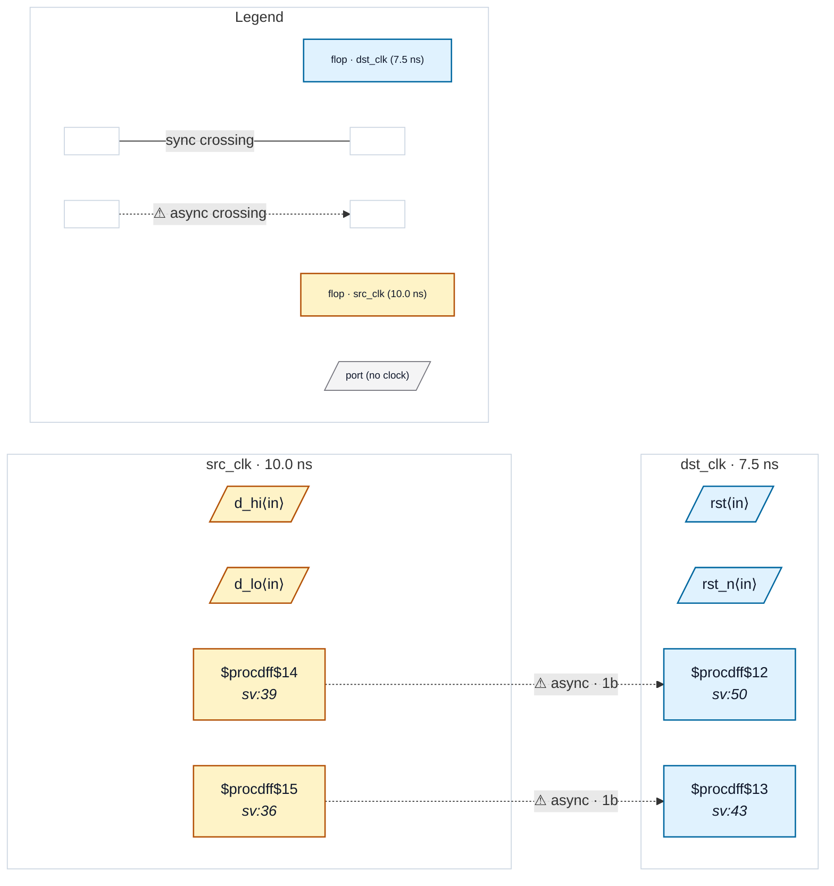

# Fixture: `good_packed_shift_sync_srst`

<!-- generator: scripts/gen_fixture_docs.py -->

Packed-shift-register synchronizer with a SYNCHRONOUS reset — the false-positive case from issue #301, the #264 follow-up. Same idiom as good_packed_shift_sync (`sr <= {sr[0], src_q}`, tapped from the top bit), but the shift lives in an `always_ff` that also resets the register to a constant on a destination-domain reset.

After `proc` the sync reset leaves a multi-bit `$mux` in front of the flop's `D`: the shift vector on one leg, the constant reset value on the other, and the reset on `S`. `D` is then no longer lane-for-lane the flop's own `Q` bits, so the packed recogniser stopped matching and CDC-001 fired a false "chain depth = 1" on every instance.

Both reset polarities and both reset values are covered: `sync_hi` is reset active-HIGH to all-zeros (shift vector on the mux's A leg) and `sync_lo` is reset active-LOW to all-ones (shift vector on the B leg). Both must stay silent — the reset only forces the lanes to a constant, it moves no data between them, so the synchroniser is still two stages deep.

The slang frontend folds the same source into an `$sdff` whose `D` is the shift vector directly (CHANGELOG #86), so it was already silent; this fixture is the yosys-frontend half of that parity.

- **Status:** positive — textbook fix; analyzer must stay silent
- **Top module:** `good_packed_shift_sync_srst`
- **Clocks:** `dst_clk` (7.5 ns), `src_clk` (10.0 ns)
- **Crossings:** 2 structural (2 async-per-SDC, 0 sync)

## Clock-domain map

## Files

- `good_packed_shift_sync_srst.json`
- `good_packed_shift_sync_srst.sdc`
- `good_packed_shift_sync_srst.sv`

---
*Generated by `scripts/gen_fixture_docs.py` — re-run after editing the SV/SDC/netlist.*
