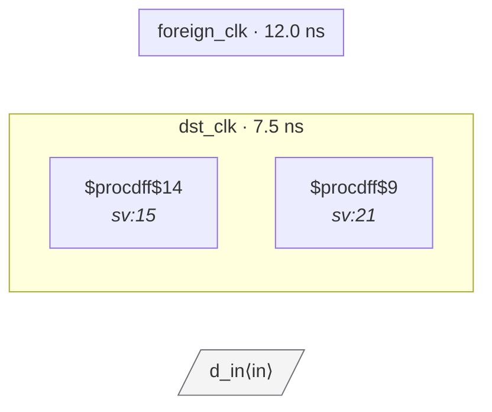

# Fixture: `good_port_typed_sync`

<!-- generator: scripts/gen_fixture_docs.py -->

Positive counterpart to bad_port_no_sync: same scenario but with a proper 2FF synchronizer in dst_clk. The port is typed via set_input_delay -clock foreign_clk, the analyzer promotes the port→flop path to a first-class crossing, but CDC-001 sees the chain depth ≥ 2 and stays silent.

- **Status:** positive — textbook fix; analyzer must stay silent
- **Top module:** `good_port_typed_sync`
- **Clocks:** `dst_clk` (7.5 ns), `foreign_clk` (12.0 ns)
- **Crossings:** 1 structural (1 async-per-SDC, 0 sync)

## Clock-domain map

## Files

- `good_port_typed_sync.json`
- `good_port_typed_sync.sdc`
- `good_port_typed_sync.sv`

---
*Generated by `scripts/gen_fixture_docs.py` — re-run after editing the SV/SDC/netlist.*
