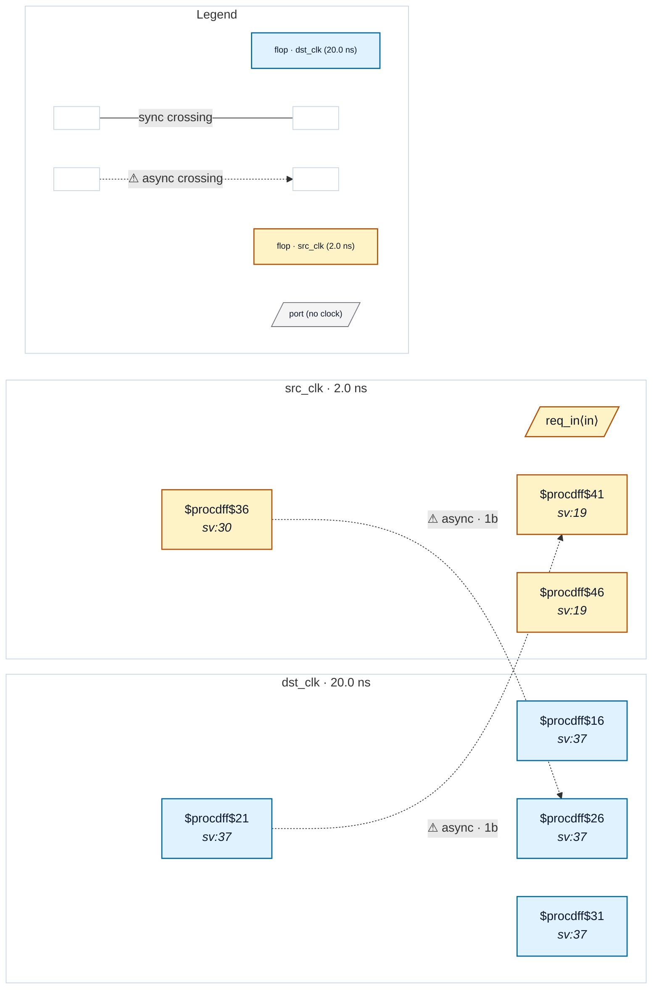

# Fixture: `good_pulse_width_handshake`

<!-- generator: scripts/gen_fixture_docs.py -->

Positive-case fixture for CDC-009: the textbook req/ack handshake from issue #47 §5 idiom 3. The src request flop is held high until the dst-side ack returns (synced back through a 2FF chain). Because the value is held across many src cycles, dst always sees a stable signal — no pulse-loss possible. CDC-009 must NOT fire (the src flop's D pin is a priority-encoded $mux nest, not an ``A & ~A_d`` edge-detector).

- **Status:** positive — textbook fix; analyzer must stay silent
- **Top module:** `good_pulse_width_handshake`
- **Clocks:** `dst_clk` (20.0 ns), `src_clk` (2.0 ns)
- **Crossings:** 2 structural (2 async-per-SDC, 0 sync)

## Clock-domain map

## Files

- `good_pulse_width_handshake.json`
- `good_pulse_width_handshake.sdc`
- `good_pulse_width_handshake.sv`

---
*Generated by `scripts/gen_fixture_docs.py` — re-run after editing the SV/SDC/netlist.*
