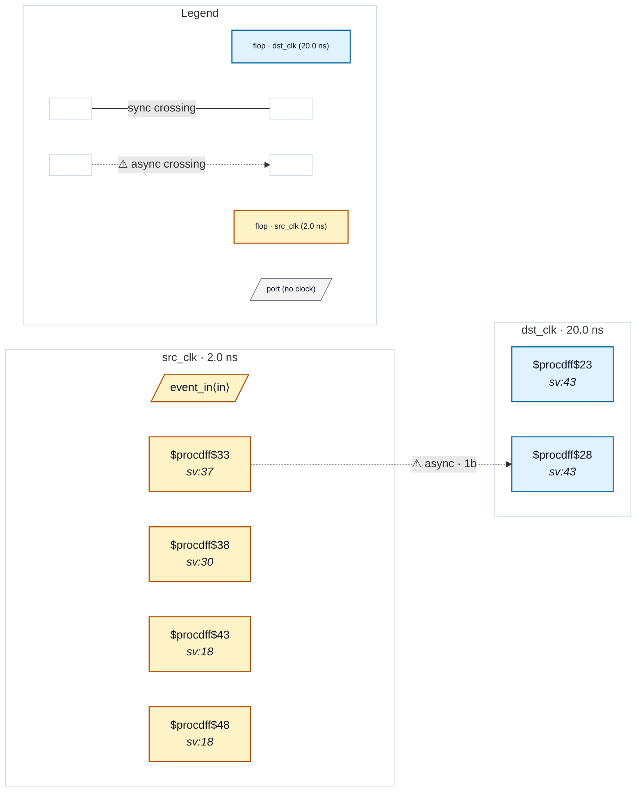

# Fixture: `good_pulse_width_stretched`

<!-- generator: scripts/gen_fixture_docs.py -->

Positive-case fixture for CDC-009: the textbook pulse-stretcher fix from issue #47 §5 idiom 1. A 4-bit countdown counter widens the src-domain strobe to 16 src cycles (~32 ns at 500 MHz) — comfortably wider than the 20 ns dst period, so dst always captures it. CDC-009 must NOT fire (the src flop's D pin is ``cnt != 0``, which yosys synthesises as a reduction, not the ``A & ~A_d`` edge-detector pattern the rule keys on).

- **Status:** positive — textbook fix; analyzer must stay silent
- **Top module:** `good_pulse_width_stretched`
- **Clocks:** `dst_clk` (20.0 ns), `src_clk` (2.0 ns)
- **Crossings:** 1 structural (1 async-per-SDC, 0 sync)

## Clock-domain map

## Files

- `good_pulse_width_stretched.json`
- `good_pulse_width_stretched.sdc`
- `good_pulse_width_stretched.sv`

---
*Generated by `scripts/gen_fixture_docs.py` — re-run after editing the SV/SDC/netlist.*
