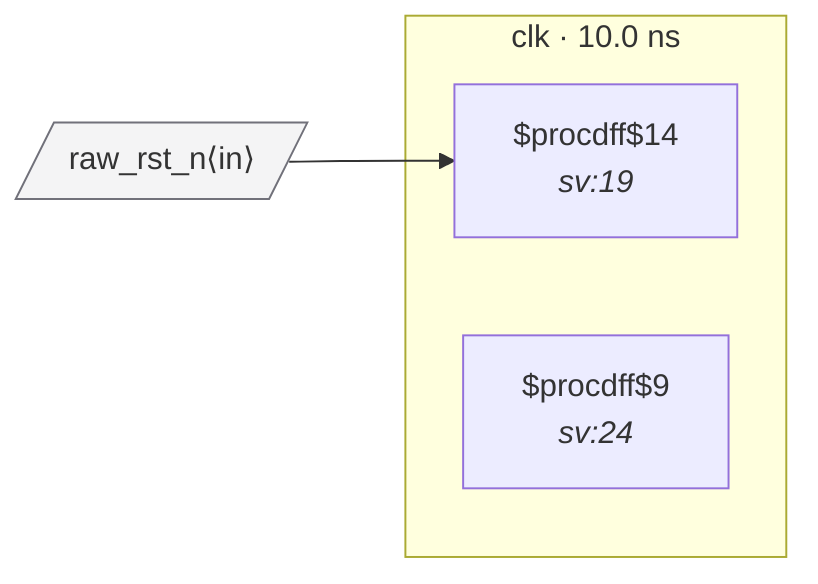

# Fixture: `good_rdc_002_polarity_match`

<!-- generator: scripts/gen_fixture_docs.py -->

Positive counterpart to bad_rdc_002_polarity_mismatch.

Same gated-reset topology, but the consumer matches the producer's polarity. Both flops are active-low reset (ARST_POLARITY=0, ARST_VALUE=0). When raw_rst_n is asserted:

```text
  gated_rst.Q → 0  (the assert value)
  q_out sees ARST=0, q_out's polarity=0 → q_out enters reset.  ✓
```

RDC-002 must stay silent.

- **Status:** positive — textbook fix; analyzer must stay silent
- **Top module:** `good_rdc_002_polarity_match`
- **Clocks:** `clk` (10.0 ns)
- **Crossings:** 0 structural (0 async-per-SDC, 0 sync)

## Clock-domain map



## Files

- `good_rdc_002_polarity_match.json`
- `good_rdc_002_polarity_match.sdc`
- `good_rdc_002_polarity_match.sv`

---
*Generated by `scripts/gen_fixture_docs.py` — re-run after editing the SV/SDC/netlist.*
