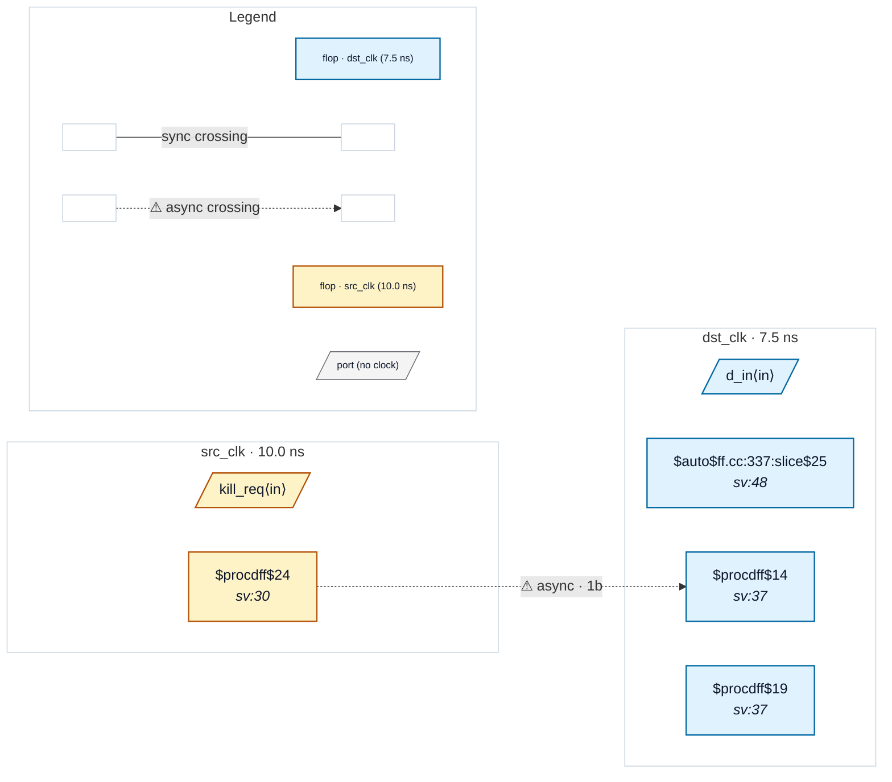

# Fixture: `good_rdc_003_sync_reset_synced`

<!-- generator: scripts/gen_fixture_docs.py -->

Positive counterpart to bad_rdc_003_sync_reset_crossing.

Same source flop (`src_rst` in src_clk), but the destination's SRST now comes from a 2FF reset synchroniser in dst_clk (`src_rst_meta` → `src_rst_sync`). The async-to-sync sample step happens inside the synchroniser, not at the consumer's SRST pin, so the consuming flop is safe.

RDC-003 stays silent because the immediate driver of the consumer's SRST is `src_rst_sync` — a flop in the same clock domain (dst_clk) as the consumer.

```text
Build (same as the bad fixture; `opt_dff` is required to fold the
mux-on-D shape into `$sdff`):
  yosys -p 'read_verilog -sv good_rdc_003_sync_reset_synced.sv;
            hierarchy -top good_rdc_003_sync_reset_synced;
            proc; opt_dff; flatten; opt_clean;
            write_json good_rdc_003_sync_reset_synced.json'
```

- **Status:** positive — textbook fix; analyzer must stay silent
- **Top module:** `good_rdc_003_sync_reset_synced`
- **Clocks:** `dst_clk` (7.5 ns), `src_clk` (10.0 ns)
- **Crossings:** 1 structural (1 async-per-SDC, 0 sync)

## Clock-domain map



## Files

- `good_rdc_003_sync_reset_synced.json`
- `good_rdc_003_sync_reset_synced.sdc`
- `good_rdc_003_sync_reset_synced.sv`

---
*Generated by `scripts/gen_fixture_docs.py` — re-run after editing the SV/SDC/netlist.*
