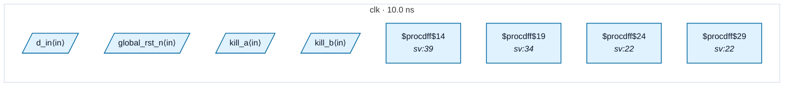

# Fixture: `good_rdc_004_registered_reset`

<!-- generator: scripts/gen_fixture_docs.py -->

Positive counterpart to bad_rdc_004_comb_driven_reset.

Same per-channel kill flops, but the AND is registered on `clk` before being used as a reset. The reset edge is glitch-free — it's the synchronous output of a flop, not a comb gate. All polarities are matched (every flop is active-low, ARST_VALUE=0) so RDC-002 stays silent too.

RDC-004 must NOT fire (the consumer's ARST is directly driven by `comb_rst_reg`'s Q, classified as ``source="inferred"``).

- **Status:** positive — textbook fix; analyzer must stay silent
- **Top module:** `good_rdc_004_registered_reset`
- **Clocks:** `clk` (10.0 ns)
- **Crossings:** 0 structural (0 async-per-SDC, 0 sync)

## Clock-domain map

## Files

- `good_rdc_004_registered_reset.json`
- `good_rdc_004_registered_reset.sdc`
- `good_rdc_004_registered_reset.sv`

---
*Generated by `scripts/gen_fixture_docs.py` — re-run after editing the SV/SDC/netlist.*
