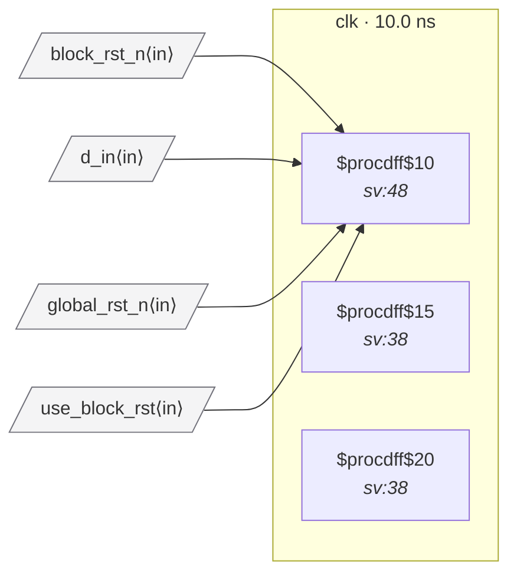

# Fixture: `good_rdc_005_muxed_reset`

<!-- generator: scripts/gen_fixture_docs.py -->

Positive counterpart to bad_rdc_005_multi_source_reset.

Same two reset ports, but a `$mux` (synthesised from a ternary) explicitly selects which one is active. The selection signal (`use_block_rst`) makes the user's intent unambiguous: at any given moment exactly one of the two reset sources is in effect.

The selected reset then passes through a local 2-FF reset synchroniser in the `clk` domain before reaching the data flop. This keeps the fixture clean for both RDC-005 *and* RDC-006:

```text
- RDC-005 must NOT fire — the immediate driver cell of the sync
  chain's reset is a `$mux`, which is the explicit-muxing
  exemption (RDC-005's whole point).
- RDC-006 must NOT fire — the sync chain's flops are recognised
  reset-synchroniser stages and are exempted; the data flop's
  ARST is a flop's Q (the sync tail), not a `$mux`, so the rule
  doesn't trigger on it either.
```

The fixture's purpose is preserved: it still demonstrates the muxed-reset exemption. The extra sync stage is what real designs also do, and is the textbook fix RDC-006 prescribes.

- **Status:** positive — textbook fix; analyzer must stay silent
- **Top module:** `good_rdc_005_muxed_reset`
- **Clocks:** `clk` (10.0 ns)
- **Crossings:** 0 structural (0 async-per-SDC, 0 sync)

## Clock-domain map



## Files

- `good_rdc_005_muxed_reset.json`
- `good_rdc_005_muxed_reset.sdc`
- `good_rdc_005_muxed_reset.sv`

---
*Generated by `scripts/gen_fixture_docs.py` — re-run after editing the SV/SDC/netlist.*
