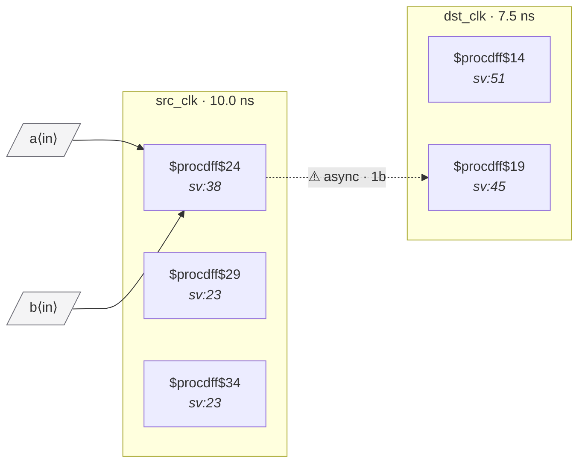

# Fixture: `good_registered_before_sync`

<!-- generator: scripts/gen_fixture_docs.py -->

Positive counterpart to bad_comb_before_sync.

The bad version routes `src_q1 & src_q2` (combinational) directly into the synchronizer's first stage — the AND can glitch when either source flop transitions, so the sync samples a transient value. Fix: register the AND output in the source domain so the signal entering the sync chain is a clean flop output. CDC-003 stays silent because min_hops between src_anded.Q and sync_meta.D is now 0 (direct flop-to-flop).

- **Status:** positive — textbook fix; analyzer must stay silent
- **Top module:** `good_registered_before_sync`
- **Clocks:** `dst_clk` (7.5 ns), `src_clk` (10.0 ns)
- **Crossings:** 1 structural (1 async-per-SDC, 0 sync)

## Clock-domain map

## Files

- `good_registered_before_sync.json`
- `good_registered_before_sync.sdc`
- `good_registered_before_sync.sv`

---
*Generated by `scripts/gen_fixture_docs.py` — re-run after editing the SV/SDC/netlist.*
