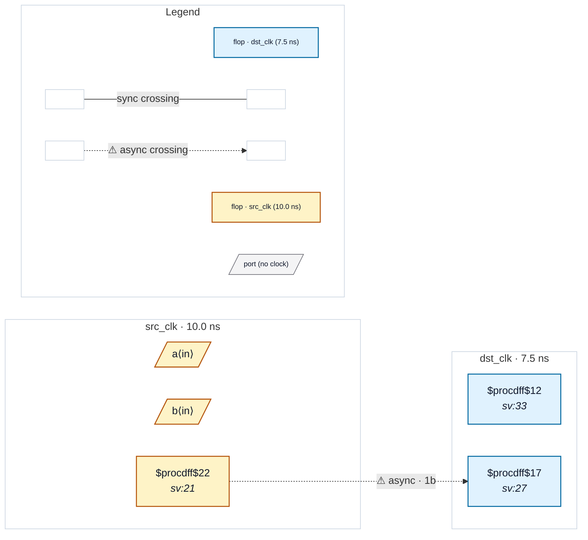

# Fixture: `good_registered_source`

<!-- generator: scripts/gen_fixture_docs.py -->

Positive counterpart to bad_comb_source.

In the bad version, top-level combinational inputs `a` and `b` are AND'd straight into the dst_clk synchronizer with no source-domain flop — the comb output can glitch and the sync may sample it. Fix: register the AND in a source clock domain *first*, then run the standard 2FF synchronizer. CDC-006 only fires when the sync's fanin reaches a top-level port without a registering flop; here the fanin terminates at src_anded, so it stays silent.

- **Status:** positive — textbook fix; analyzer must stay silent
- **Top module:** `good_registered_source`
- **Clocks:** `dst_clk` (7.5 ns), `src_clk` (10.0 ns)
- **Crossings:** 1 structural (1 async-per-SDC, 0 sync)

## Clock-domain map

## Files

- `good_registered_source.json`
- `good_registered_source.sdc`
- `good_registered_source.sv`

---
*Generated by `scripts/gen_fixture_docs.py` — re-run after editing the SV/SDC/netlist.*
