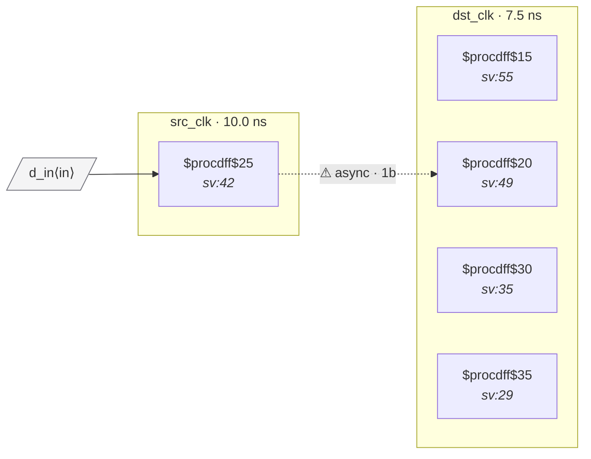

# Fixture: `good_reset_sync`

<!-- generator: scripts/gen_fixture_docs.py -->

Positive counterpart to bad_reset_crossing.

The bad version uses a src_clk-domain flop's Q as the async reset of a dst_clk flop — the dst flop's recovery edge is unrelated to dst_clk, risking metastability on de-assertion. Fix: a dedicated "reset synchronizer" — a 2FF chain in dst_clk whose ARST input is the *primary* (top-level) async reset, providing async-assert / sync-deassert semantics. The data-path flops then use the synchronizer's output as their ARST.

CDC-007 stays silent: each flop's ARST is either a top-level port (`raw_rst_n` for the synchronizer's own flops) or a same-domain flop (`dst_rst_n_sync` for the data-path flops).

- **Status:** positive — textbook fix; analyzer must stay silent
- **Top module:** `good_reset_sync`
- **Clocks:** `dst_clk` (7.5 ns), `src_clk` (10.0 ns)
- **Crossings:** 1 structural (1 async-per-SDC, 0 sync)

## Clock-domain map

## Files

- `good_reset_sync.json`
- `good_reset_sync.sdc`
- `good_reset_sync.sv`

---
*Generated by `scripts/gen_fixture_docs.py` — re-run after editing the SV/SDC/netlist.*
